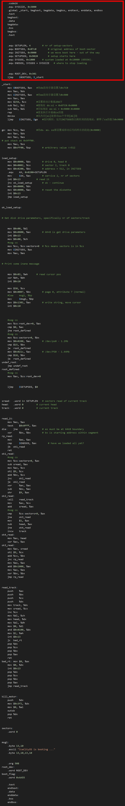
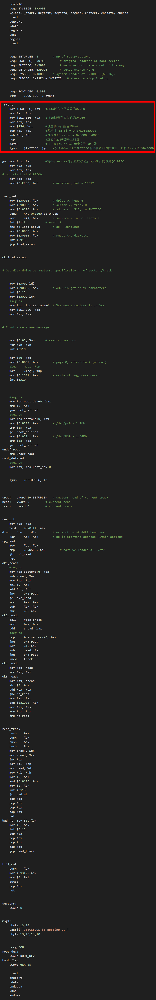

# 第五部分，逐行代码讲解
# 第4章，ROOT_DEV = ORIG_ROOT_DEV;

```c
ROOT_DEV = ORIG_ROOT_DEV;
```
上文说到，我们的操作系统需要知道从哪里开始访问磁盘的文件系统。并专门为操作系统发现文件系统入口的行为定义了一个词——"挂载"。
下面的这行代码。就是进行的**挂载操作**。

```c
ROOT_DEV = ORIG_ROOT_DEV;
```

显然，我们将这个赋值语句两边的变量讲清楚就好了。

## 1. ORIG_ROOT_DEV
ORIG_ROOT_DEV：这是 **Bootloader**在内存中留下的一个 **标记**，它记录了根分区(文件系统的起点)在哪里。这是操作系统指向挂载的依据。

什么？有点懵？没关系，我们来慢慢讲清楚。
我们先讲清楚 **Bootloader** 。

> 记住，我们是以main()为主线的，讲清楚了Bootloader后，会及时扣回`ROOT_DEV = ORIG_ROOT_DEV;`,所以大家不要感觉凌乱，要做到心中有数。

### 1.1 Bootloader
前文说到，操作系统分为两个部分：bootloader和kernel，真正对对接硬件、管理软件的部分是kernel。最初两者都是在硬盘上躺着，并没有在内存中运行，bios芯片将bootloader加载到内存中后，bootloader再来将kernel记载到内存中运行，这才是操作系统启动的整个过程。

那么，在Linux系统中，充当bootloader功能的，就是**源码下的boot目录**：
里面有3个文件，如下：
```c
├── boot
│   ├── bootsect.S
│   ├── setup.S
│   └── head.S
```
这三个文件各有功能，但最终**三者合力将kernel顺利地加载到内存中运行**，并**设置运行的基本环境**。

我按照执行顺序：bootsect.S -> setup.S -> head.S，依次讲解各文件内容和功能。

> 从这里，我们也就开始从main函数主线，开始开支散叶，依次讲解kernel的代码了。

### 1.2 bootsect.S
为了一目了然，我们先逐一讲解功能，后面载梳理出功能背后的原理以及代码实现。
#### 1.2.1 前置背景：

##### 1.2.1.1 操作系统源码被编译为几个块？
最初，我们的操作系统是一堆代码。通过前面的铺垫，我们知道，这其实本质上，就是一堆高低电平的组合。
但是这堆组合现在需要通过一些处理才能变为能够跑在内存里面被CPU执行的物理实体。也就是，需要将这堆组合转化一下。
这就像，我们从土里打出水稻，还需要晒干、去壳、煮熟，才能吃到米饭一样。

我们吧可以直接在内存中运行的高低电平的二进制信息叫做机器码。
所以，我们要想能够执行操作系统，就要将我们敲下操作系统源码转化为机器码。
这个过程就叫编译。

在此过程中，操作系统被编译成多个数据块，分别是bootsect、setup、system，详情如下：

|数据块|组成源码文件|
|-|-|
|bootsect|bootsect.s|
|setup|setup.s|
|system|head.s和剩下所有的内核源码|

从这里我们也看到，bootloader的功能，分别在3个数据块中得到完成的。

##### 1.2.1.2 BIOS的功能
我们要有一个共识，就是CPU决定执行何处的代码，是由PC寄存器决定的，而这个PC寄存器的值，由CS寄存器和IP寄存器共同决定。
在实模式下，PC=CS<<4+IP
所以一开机，PC的值就指向了BIOS芯片的内存映射，即0xFFFF0，具体来说：
>在你开机的一瞬间，CPU 的 PC 寄存器被强制初始化为 0xFFFF0。如果再说具体些，CPU 将段基址寄存器 cs 初始化为 0xF000，将偏移地址寄存器 IP 初始化为 0xFFF0，根据实模式下的最终地址计算规则，将段基址左移 4 位，加上偏移地址，得到最终的物理地址也就是抽象出来的 PC 寄存器地址为 0xFFFF0。

然后，BIOS再加载bootsect.s到0x7c00地址处。操作系统的加载工作正式开始。

===

>  PC 寄存器，其全称是 Program Counter，中文名为程序计数器。

bootsect.s被编译后，最初躺在磁盘里面，开机后，它被BIOS加载到内存0x7c00地址处。

至于开机后，BIOS为啥能执行加载操作，属于操作系统上游知识，我们将其知识屏蔽，如若你确实想搞懂，建议看此文：https://mp.weixin.qq.com/s?__biz=MzkxMDc1MDg1Nw==&mid=2247508490&idx=1&sn=0746c9238b07b0a9349189ad4e77606d&source=41&poc_token=HJLjJmmjcIRqF_VuMHpowLJLzKGtPvea27ve4YwD

#### 1.2.2 功能：
```
1.将自身数据从0x7c00地址处的512B的启动区数据到0x90000处，并跳转至此处工作。
2.内存初始规划。将ds、ss、es设置为0x9000,sp设置为Oxff00，奠定了CPU访问三大段的基调。
3.加载硬盘中setup.s编译块到0x90200地址处。
4.加载硬盘中剩下的所有操作系统内核代码编译块到0x90000地址处。
```

#### 1.2.3 为啥需要这么实现?
|bootsect.S的功能|拥有此功能的原因|
|-|-|
|1.将自身数据从0x7c00地址处的512B的启动区数据到0x90000处，并跳转至此处工作。|这是因为0x7c00这个地址是历史遗留，BIOS加载bootsect.s到0x7c00地址处，是为了兼容旧的硬件，且已经形成了业界标准。但是我们发现0x7c00这个值较小，而且后续setup块会紧贴着bootsect被加载，如果在0x7c00处的话，加载system块时，就会把setup块覆盖，导致执行不了，所以bootsect.s主动将自己移动到后面去，避免此风险。并且0x7c00这个地址也很奇怪，毕竟，如果哪里都可以加载，为啥不加载到一个整数的地址处呢？所以此处就将其加载到了0x90000地址处，后续的代码都将从0x90000地址处开始执行。|
|2.内存初始规划。将ds、ss、es设置为0x9000,sp设置为0xff00，奠定了CPU访问三大段的基调。|CPU是通过CS段和IP偏移地址来唯一确定究竟该访问哪一个数据的？也就是说，addr=f(cs,ip)。我们称之为CPU的段式管理，这也是CPU管理内存的方式之一(后面还有页式管理，后面再说)。所以，为了方便CPU访问数据，并且将各个数据段明确分工，内存被划分为：代码段、数据段、堆栈段、附加段。顾名思义，代码段就是用来存放代码的内存区域；数据段，就是用来存放数据的内存区域；堆栈段，就是用来拥有先进先出功能的内存区域；附加段，就是附加的一个内存区域，功能自定。CPU通过访问这些段寄存器的值再加上对应的寄存器中的偏移地址，完成数据的唯一定位。所以ds、ss、es的值，就决定了内存的规划，这里将ds、ss、es设置为0x9000，就是为了统一内存规划。其次，将sp堆栈指针设置为0xff00是为了让堆栈的栈顶够高，避免和下面的内存的数据相撞。|
|3.加载硬盘中setup.s编译块到0x90200地址处。|现在这是操作系统源码编译后的第2块数据块，将其加载到bootsect数据块后面，方便其在内存中运行是理所当然的。|
|4.加载硬盘中剩下的所有操作系统内核代码编译块到0x90000地址处。|现在加载操作系统的第3块数据块，system数据块，这才是真正的内核块。也就是说，前面加载的bootsect、setup数据块，都会逐一被覆盖，OS启动完毕后，只有system中的模块跑在内存中。|

0x10000，0x7c00,一共有多少个字节？

#### 1.2.4 bootsect.S全代码实现：
```s
	.code16
    .equ SYSSIZE, 0x3000
	.global _start, begtext, begdata, begbss, endtext, enddata, endbss
	.text
	begtext:
	.data
	begdata:
	.bss
	begbss:
	.text

	.equ SETUPLEN, 4		# nr of setup-sectors
	.equ BOOTSEG, 0x07c0		# original address of boot-sector
	.equ INITSEG, 0x9000		# we move boot here - out of the way
	.equ SETUPSEG, 0x9020		# setup starts here
	.equ SYSSEG, 0x1000		# system loaded at 0x10000 (65536).
	.equ ENDSEG, SYSSEG + SYSSIZE	# where to stop loading

	.equ ROOT_DEV, 0x301
	ljmp    $BOOTSEG, $_start
    
_start:
	mov	$BOOTSEG, %ax	#将ds段寄存器设置为0x7C0
	mov	%ax, %ds
	mov	$INITSEG, %ax	#将es段寄存器设置为0x900
	mov	%ax, %es
	mov	$256, %cx		#设置移动计数值256字
	sub	%si, %si		#源地址	ds:si = 0x07C0:0x0000
	sub	%di, %di		#目标地址 es:si = 0x9000:0x0000
	rep					#重复执行并递减cx的值
	movsw				#从内存[si]处移动cx个字到[di]处
	ljmp	$INITSEG, $go	#段间跳转，这里INITSEG指出跳转到的段地址，解释了cs的值为0x9000

go:	mov	%cs, %ax		#将ds，es，ss都设置成移动后代码所在的段处(0x9000)
	mov	%ax, %ds
	mov	%ax, %es
# put stack at 0x9ff00.
	mov	%ax, %ss
	mov	$0xFF00, %sp		# arbitrary value >>512

load_setup:
	mov	$0x0000, %dx		# drive 0, head 0
	mov	$0x0002, %cx		# sector 2, track 0
	mov	$0x0200, %bx		# address = 512, in INITSEG
	.equ    AX, 0x0200+SETUPLEN
	mov     $AX, %ax		# service 2, nr of sectors
	int	$0x13			# read it
	jnc	ok_load_setup		# ok - continue
	mov	$0x0000, %dx
	mov	$0x0000, %ax		# reset the diskette
	int	$0x13
	jmp	load_setup

ok_load_setup:

# Get disk drive parameters, specifically nr of sectors/track

	mov	$0x00, %dl
	mov	$0x0800, %ax		# AH=8 is get drive parameters
	int	$0x13
	mov	$0x00, %ch
	#seg cs
	mov	%cx, %cs:sectors+0	# %cs means sectors is in %cs
	mov	$INITSEG, %ax
	mov	%ax, %es

# Print some inane message

	mov	$0x03, %ah		# read cursor pos
	xor	%bh, %bh
	int	$0x10
	
	mov	$30, %cx
	mov	$0x0007, %bx		# page 0, attribute 7 (normal)
	#lea	msg1, %bp
	mov     $msg1, %bp
	mov	$0x1301, %ax		# write string, move cursor
	int	$0x10


	#seg cs
	mov	%cs:root_dev+0, %ax
	cmp	$0, %ax
	jne	root_defined
	#seg cs
	mov	%cs:sectors+0, %bx
	mov	$0x0208, %ax		# /dev/ps0 - 1.2Mb
	cmp	$15, %bx
	je	root_defined
	mov	$0x021c, %ax		# /dev/PS0 - 1.44Mb
	cmp	$18, %bx
	je	root_defined
undef_root:
	jmp undef_root
root_defined:
	#seg cs
	mov	%ax, %cs:root_dev+0

	ljmp	$SETUPSEG, $0


sread:	.word 1+ SETUPLEN	# sectors read of current track
head:	.word 0			# current head
track:	.word 0			# current track

read_it:
	mov	%es, %ax
	test	$0x0fff, %ax
die:	jne 	die			# es must be at 64kB boundary
	xor 	%bx, %bx		# bx is starting address within segment
rp_read:
	mov 	%es, %ax
 	cmp 	$ENDSEG, %ax		# have we loaded all yet?
	jb	ok1_read
	ret
ok1_read:
	#seg cs
	mov	%cs:sectors+0, %ax
	sub	sread, %ax
	mov	%ax, %cx
	shl	$9, %cx
	add	%bx, %cx
	jnc 	ok2_read
	je 	ok2_read
	xor 	%ax, %ax
	sub 	%bx, %ax
	shr 	$9, %ax
ok2_read:
	call 	read_track
	mov 	%ax, %cx
	add 	sread, %ax
	#seg cs
	cmp 	%cs:sectors+0, %ax
	jne 	ok3_read
	mov 	$1, %ax
	sub 	head, %ax
	jne 	ok4_read
	incw    track 
ok4_read:
	mov	%ax, head
	xor	%ax, %ax
ok3_read:
	mov	%ax, sread
	shl	$9, %cx
	add	%cx, %bx
	jnc	rp_read
	mov	%es, %ax
	add	$0x1000, %ax
	mov	%ax, %es
	xor	%bx, %bx
	jmp	rp_read

read_track:
	push	%ax
	push	%bx
	push	%cx
	push	%dx
	mov	track, %dx
	mov	sread, %cx
	inc	%cx
	mov	%dl, %ch
	mov	head, %dx
	mov	%dl, %dh
	mov	$0, %dl
	and	$0x0100, %dx
	mov	$2, %ah
	int	$0x13
	jc	bad_rt
	pop	%dx
	pop	%cx
	pop	%bx
	pop	%ax
	ret
bad_rt:	mov	$0, %ax
	mov	$0, %dx
	int	$0x13
	pop	%dx
	pop	%cx
	pop	%bx
	pop	%ax
	jmp	read_track

kill_motor:
	push	%dx
	mov	$0x3f2, %dx
	mov	$0, %al
	outsb
	pop	%dx
	ret

sectors:
	.word 0

msg1:
	.byte 13,10
	.ascii "IceCityOS is booting ..."
	.byte 13,10,13,10

	.org 508
root_dev:
	.word ROOT_DEV
boot_flag:
	.word 0xAA55
	
	.text
	endtext:
	.data
	enddata:
	.bss
	endbss:
```
#### 1.2.5 bootsect.S代码精讲：
我们以_start标记为界，上面这部分代码如下：

全视图：

```s
    .code16 
    # 告诉汇编器， 接下来以16 位实模式 的 x86 指令集编译。
    # 背景：CPU 上电后默认进入实模式（8086 兼容模式），只能访问 1MB 内存，且段地址 + 偏移的寻址方式是 段地址*16 + 偏移，因此必须显式指定 16 位模式。
    .equ SYSSIZE, 0x3000 
    # 设置系统段system二进制数据块占用的内存空间段的大小，为0x3000字节，则换算为地址大小为0x30000,即196KB,足够Linux0.11了
	.global _start, begtext, begdata, begbss, endtext, enddata, endbss 
    # 将这些符号声明为全局可见，供链接器（ld）或其他模块（如 setup.s、内核）引用。
    # _start：程序入口点（链接器会将此符号作为代码执行的起始位置）；
    # begtext/endtext：代码段（.text）的起始 / 结束地址；
    # begdata/enddata：数据段（.data）的起始 / 结束地址；
    # begbss/endbss：未初始化数据段（.bss）的起始 / 结束地址；
	.text   
    #.text：代码段（存放执行指令，只读）；
	begtext:
    # 代码段开始了
	.data   
    #.data：数据段（存放已初始化的全局变量）；
	begdata:
	# 数据段开始了
    .bss    
    #.bss：未初始化数据段（存放未初始化的全局变量，运行时会被清零）；
	begbss:
	.text   
    # 最后再次写 .text：将后续代码切回代码段（因为前面切到了.bss 段），保证启动指令在代码段执行。

    # .equ：汇编伪指令，用于定义常量（类似 C 语言的 #define），后续代码可直接使用这些常量名；
	.equ SETUPLEN, 4		
    #  setup.s编译而成的数据所占扇区数，为4
	.equ BOOTSEG, 0x07c0		
    # 引导区初始段位置，0x07c0
	.equ INITSEG, 0x9000		
    # 把引导区移动到0x9000段地址处，防止被后续要加载的内容覆盖。
    # linus的原话是，we move boot here - out of the way，即别挡路！
	.equ SETUPSEG, 0x9020		
    # setup.s编译而成的数据所在段位置，0x9020
	.equ SYSSEG, 0x1000		
    # 系统段system初始段位置，0x1000
	.equ ENDSEG, SYSSEG + SYSSIZE	
    # 系统段system二进制数据块结束位置，总共加载的大小196KB。远远足够我们的system数据大小了。
	.equ ROOT_DEV, 0x301 
    #根文件系统所在的设备号（0x301 对应第一个 IDE 硬盘的第一个分区）
	ljmp    $BOOTSEG, $_start 
    # 执行远跳转（long jump），同时设置 CS 段寄存器(为$BOOTSEG)和 IP 指令指针寄存器(为$_start)，进入真正的启动逻辑。
    # 这里就是跳到bootsect自己复制自己的位置。
    # 前面说了，这里是因为担心自己挡路，导致setup块被后面的system模块覆盖(因为setup紧跟着bootsect块)，所以复制自身，所以这里就跳过去了！
```
显然，这是做的一些列全局变量的赋值之类的，类似于C语言的全局变量赋值。
##### 1.2.5.1 明确指出了各个段的位置和大小：
这里也明确指出了操作系统的各个组成模块的位置和大小。
```s
 .equ SYSSIZE, 0x3000   # 指出system大小为3*1024字节，即196KB
 .equ SETUPLEN, 4	    # 指出setup块所占扇区数，为4
 .equ BOOTSEG, 0x07c0	# 指出bootsect块的初始的位置的段大小，为0x07c0
 .equ INITSEG, 0x9000	# 指出把引导区移动到0x9000段地址处，防止被后续要加载的内容覆盖。
 .equ SETUPSEG, 0x9020	# 指出setup块被加载的位置的段大小，0x9020
 .equ SYSSEG, 0x1000	# 指出system块被加载的位置的段大小，0x1000
 .equ ENDSEG, SYSSEG + SYSSIZE	# 系统段system二进制数据块结束位置的段大小，总共加载的大小196KB。远远足够我们的system数据大小了。
```

##### 1.2.5.2 明确指出了根文件系统所在的设备号：
这句，就是我们main()的第一句左边的变量，ROOT_DEV,明确其值为`0x301`.
```s
 .equ ROOT_DEV, 0x301 
```
0x301对应于硬盘的第一个分区。

##### 1.2.5.3 跳转到BOOTSEG段，_start偏移处，即0x7c00:_start处执行正式的代码了！

其实，这就是紧接着下面的指令罢了：
全视图：

```s
_start:
	mov	$BOOTSEG, %ax	#将ds段寄存器设置为0x7C00，即引导区所在的段地址
	mov	%ax, %ds
	mov	$INITSEG, %ax	#将es段寄存器设置为0x9000，即引导区移动到的段地址
	mov	%ax, %es
	mov	$256, %cx		#设置移动计数值256字
	sub	%si, %si		#源地址	ds:si = 0x07C0:0x0000
	sub	%di, %di		#目标地址 es:si = 0x9000:0x0000
	rep					#重复执行并递减cx的值
	movsw				#从内存[si]处移动cx个字到[di]处
```
显然，我们可以看到，这里是将引导区复制到0x9000段地址处，防止被后续要加载的内容覆盖。
所以，这里完成了bootsect的第一个功能：**将自身bootsect复制到0x9000段地址处。**


### 1.2.ROOT_DEV
ROOT_DEV：这是**内核内部使用的全局变量**，后续代码（如**挂载根文件系统 mount_root()**）会读取这个变量，来决定**去哪个磁盘分区上找 ls、cat等等 程序**。


## 1.作用
简单来说，这段赋值代码的作用是：从 `BIOS / 引导加载程序（Bootloader）`留下的 `“遗产”` 中，`读取用户指定的 “根文件系统设备号”`，并将其赋值给`内核全局变量 ROOT_DEV`。