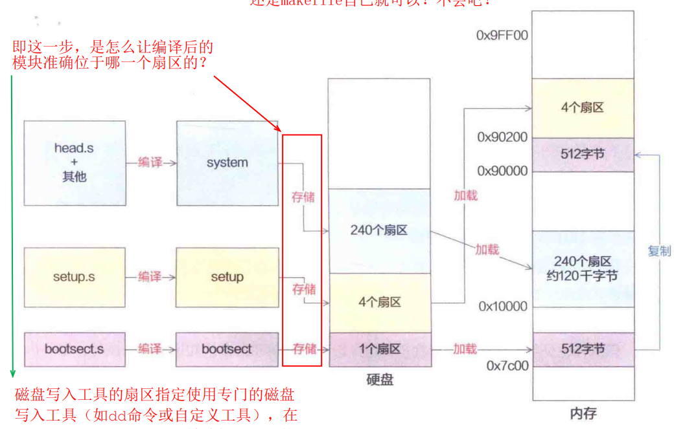

# 第五部分，逐行代码讲解
# 第4章，ROOT_DEV = ORIG_ROOT_DEV;

```c
ROOT_DEV = ORIG_ROOT_DEV;
```
上文说到，我们的操作系统需要知道从哪里开始访问磁盘的文件系统。并专门为操作系统发现文件系统入口的行为定义了一个词——"挂载"。
下面的这行代码。就是进行的**挂载操作**。

```c
ROOT_DEV = ORIG_ROOT_DEV;
```

显然，我们将这个赋值语句两边的变量讲清楚就好了。

## 1. ORIG_ROOT_DEV 解析
ORIG_ROOT_DEV：这是 **Bootloader**在内存中留下的一个 **标记**，它记录了根分区(文件系统的起点)在哪里。这是操作系统指向挂载的依据。

什么？有点懵？没关系，我们来慢慢讲清楚。
我们先讲清楚 **Bootloader** 。

> 记住，我们是以main()为主线的，讲清楚了Bootloader后，会及时扣回`ROOT_DEV = ORIG_ROOT_DEV;`,所以大家不要感觉凌乱，要做到心中有数。

### 1.1 Bootloader
前文说到，操作系统分为两个部分：bootloader和kernel，真正对对接硬件、管理软件的部分是kernel。最初两者都是在硬盘上躺着，并没有在内存中运行，bios芯片将bootloader加载到内存中后，bootloader再来将kernel记载到内存中运行，这才是操作系统启动的整个过程。

那么，在Linux系统中，充当bootloader功能的，就是**源码下的boot目录**：
里面有3个文件，如下：
```c
├── boot
│   ├── bootsect.S
│   ├── setup.S
│   └── head.S
```
这三个文件各有功能，但最终**三者合力将kernel顺利地加载到内存中运行**，并**设置运行的基本环境**。

我按照执行顺序：bootsect.S -> setup.S -> head.S，依次讲解各文件内容和功能。

> 从这里，我们也就开始从main函数主线，开始开支散叶，依次讲解kernel的代码了。

### 1.2 bootsect.S
为了一目了然，我们先逐一讲解功能，后面载梳理出功能背后的原理以及代码实现。
#### 1.2.1 前置背景：

##### 1.2.1.1 操作系统源码被编译为几个块？
最初，我们的操作系统是一堆代码。通过前面的铺垫，我们知道，这其实本质上，就是一堆高低电平的组合。
但是这堆组合现在需要通过一些处理才能变为能够跑在内存里面被CPU执行的物理实体。也就是，需要将这堆组合转化一下。
这就像，我们从土里打出水稻，还需要晒干、去壳、煮熟，才能吃到米饭一样。

我们吧可以直接在内存中运行的高低电平的二进制信息叫做机器码。
所以，我们要想能够执行操作系统，就要将我们敲下操作系统源码转化为机器码。
这个过程就叫编译。

在此过程中，操作系统被编译成多个数据块，分别是bootsect、setup、system，详情如下：

|数据块|组成源码文件|
|-|-|
|bootsect|bootsect.s|
|setup|setup.s|
|system|head.s和剩下所有的内核源码|

从这里我们也看到，bootloader的功能，分别在3个数据块中得到完成的。

##### 1.2.1.2 BIOS的功能
我们要有一个共识，就是CPU决定执行何处的代码，是由PC寄存器决定的，而这个PC寄存器的值，由CS寄存器和IP寄存器共同决定。
在实模式下，PC=CS<<4+IP
所以一开机，PC的值就指向了BIOS芯片的内存映射，即0xFFFF0，具体来说：
>在你开机的一瞬间，CPU 的 PC 寄存器被强制初始化为 0xFFFF0。如果再说具体些，CPU 将段基址寄存器 cs 初始化为 0xF000，将偏移地址寄存器 IP 初始化为 0xFFF0，根据实模式下的最终地址计算规则，将段基址左移 4 位，加上偏移地址，得到最终的物理地址也就是抽象出来的 PC 寄存器地址为 0xFFFF0。

然后，BIOS再加载bootsect.s到0x7c00地址处。操作系统的加载工作正式开始。

===

>  PC 寄存器，其全称是 Program Counter，中文名为程序计数器。

bootsect.s被编译后，最初躺在磁盘里面，开机后，它被BIOS加载到内存0x7c00地址处。

至于开机后，BIOS为啥能执行加载操作，属于操作系统上游知识，我们将其知识屏蔽，如若你确实想搞懂，建议看此文：https://mp.weixin.qq.com/s?__biz=MzkxMDc1MDg1Nw==&mid=2247508490&idx=1&sn=0746c9238b07b0a9349189ad4e77606d&source=41&poc_token=HJLjJmmjcIRqF_VuMHpowLJLzKGtPvea27ve4YwD

#### 1.2.2 功能：
```
1.将自身数据从0x7c00地址处的512B的启动区数据到0x90000处，并跳转至此处工作。
2.内存初始规划。将ds、ss、es设置为0x9000,sp设置为Oxff00，奠定了CPU访问三大段的基调。
3.加载硬盘中setup.s编译块到0x90200地址处。
4.加载硬盘中剩下的所有操作系统内核代码编译块到0x90000地址处。
```

#### 1.2.3 为啥需要这么实现?
|bootsect.S的功能|拥有此功能的原因|
|-|-|
|1.将自身数据从0x7c00地址处的512B的启动区数据到0x90000处，并跳转至此处工作。|这是因为0x7c00这个地址是历史遗留，BIOS加载bootsect.s到0x7c00地址处，是为了兼容旧的硬件，且已经形成了业界标准。但是我们发现0x7c00这个值较小，而且后续setup块会紧贴着bootsect被加载，如果在0x7c00处的话，加载system块时，就会把setup块覆盖，导致执行不了，所以bootsect.s主动将自己移动到后面去，避免此风险。并且0x7c00这个地址也很奇怪，毕竟，如果哪里都可以加载，为啥不加载到一个整数的地址处呢？所以此处就将其加载到了0x90000地址处，后续的代码都将从0x90000地址处开始执行。|
|2.内存初始规划。将ds、ss、es设置为0x9000,sp设置为0xff00，奠定了CPU访问三大段的基调。|CPU是通过CS段和IP偏移地址来唯一确定究竟该访问哪一个数据的？也就是说，addr=f(cs,ip)。我们称之为CPU的段式管理，这也是CPU管理内存的方式之一(后面还有页式管理，后面再说)。所以，为了方便CPU访问数据，并且将各个数据段明确分工，内存被划分为：代码段、数据段、堆栈段、附加段。顾名思义，代码段就是用来存放代码的内存区域；数据段，就是用来存放数据的内存区域；堆栈段，就是用来拥有先进先出功能的内存区域；附加段，就是附加的一个内存区域，功能自定。CPU通过访问这些段寄存器的值再加上对应的寄存器中的偏移地址，完成数据的唯一定位。所以ds、ss、es的值，就决定了内存的规划，这里将ds、ss、es设置为0x9000，就是为了统一内存规划。其次，将sp堆栈指针设置为0xff00是为了让堆栈的栈顶够高，避免和下面的内存的数据相撞。|
|3.加载硬盘中setup.s编译块到0x90200地址处。|现在这是操作系统源码编译后的第2块数据块，将其加载到bootsect数据块后面，方便其在内存中运行是理所当然的。|
|4.加载硬盘中剩下的所有操作系统内核代码编译块到0x90000地址处。|现在加载操作系统的第3块数据块，system数据块，这才是真正的内核块。也就是说，前面加载的bootsect、setup数据块，都会逐一被覆盖，OS启动完毕后，只有system中的模块跑在内存中。|

0x10000，0x7c00,一共有多少个字节？

#### 1.2.4 bootsect.S全代码实现：
```s
	.code16
    .equ SYSSIZE, 0x3000
	.global _start, begtext, begdata, begbss, endtext, enddata, endbss
	.text
	begtext:
	.data
	begdata:
	.bss
	begbss:
	.text

	.equ SETUPLEN, 4		# nr of setup-sectors
	.equ BOOTSEG, 0x07c0		# original address of boot-sector
	.equ INITSEG, 0x9000		# we move boot here - out of the way
	.equ SETUPSEG, 0x9020		# setup starts here
	.equ SYSSEG, 0x1000		# system loaded at 0x10000 (65536).
	.equ ENDSEG, SYSSEG + SYSSIZE	# where to stop loading

	.equ ROOT_DEV, 0x301
	ljmp    $BOOTSEG, $_start
    
_start:
	mov	$BOOTSEG, %ax	#将ds段寄存器设置为0x7C0
	mov	%ax, %ds
	mov	$INITSEG, %ax	#将es段寄存器设置为0x900
	mov	%ax, %es
	mov	$256, %cx		#设置移动计数值256字
	sub	%si, %si		#源地址	ds:si = 0x07C0:0x0000
	sub	%di, %di		#目标地址 es:si = 0x9000:0x0000
	rep					#重复执行并递减cx的值
	movsw				#从内存[si]处移动cx个字到[di]处
	ljmp	$INITSEG, $go	#段间跳转，这里INITSEG指出跳转到的段地址，解释了cs的值为0x9000

go:	mov	%cs, %ax		#将ds，es，ss都设置成移动后代码所在的段处(0x9000)
	mov	%ax, %ds
	mov	%ax, %es
# put stack at 0x9ff00.
	mov	%ax, %ss
	mov	$0xFF00, %sp		# arbitrary value >>512

load_setup:
	mov	$0x0000, %dx		# drive 0, head 0
	mov	$0x0002, %cx		# sector 2, track 0
	mov	$0x0200, %bx		# address = 512, in INITSEG
	.equ    AX, 0x0200+SETUPLEN
	mov     $AX, %ax		# service 2, nr of sectors
	int	$0x13			# read it
	jnc	ok_load_setup		# ok - continue
	mov	$0x0000, %dx
	mov	$0x0000, %ax		# reset the diskette
	int	$0x13
	jmp	load_setup

ok_load_setup:

# Get disk drive parameters, specifically nr of sectors/track

	mov	$0x00, %dl
	mov	$0x0800, %ax		# AH=8 is get drive parameters
	int	$0x13
	mov	$0x00, %ch
	#seg cs
	mov	%cx, %cs:sectors+0	# %cs means sectors is in %cs
	mov	$INITSEG, %ax
	mov	%ax, %es

# Print some inane message

	mov	$0x03, %ah		# read cursor pos
	xor	%bh, %bh
	int	$0x10
	
	mov	$30, %cx
	mov	$0x0007, %bx		# page 0, attribute 7 (normal)
	#lea	msg1, %bp
	mov     $msg1, %bp
	mov	$0x1301, %ax		# write string, move cursor
	int	$0x10


	#seg cs
	mov	%cs:root_dev+0, %ax
	cmp	$0, %ax
	jne	root_defined
	#seg cs
	mov	%cs:sectors+0, %bx
	mov	$0x0208, %ax		# /dev/ps0 - 1.2Mb
	cmp	$15, %bx
	je	root_defined
	mov	$0x021c, %ax		# /dev/PS0 - 1.44Mb
	cmp	$18, %bx
	je	root_defined
undef_root:
	jmp undef_root
root_defined:
	#seg cs
	mov	%ax, %cs:root_dev+0

	ljmp	$SETUPSEG, $0


sread:	.word 1+ SETUPLEN	# sectors read of current track
head:	.word 0			# current head
track:	.word 0			# current track

read_it:
	mov	%es, %ax
	test	$0x0fff, %ax
die:	jne 	die			# es must be at 64kB boundary
	xor 	%bx, %bx		# bx is starting address within segment
rp_read:
	mov 	%es, %ax
 	cmp 	$ENDSEG, %ax		# have we loaded all yet?
	jb	ok1_read
	ret
ok1_read:
	#seg cs
	mov	%cs:sectors+0, %ax
	sub	sread, %ax
	mov	%ax, %cx
	shl	$9, %cx
	add	%bx, %cx
	jnc 	ok2_read
	je 	ok2_read
	xor 	%ax, %ax
	sub 	%bx, %ax
	shr 	$9, %ax
ok2_read:
	call 	read_track
	mov 	%ax, %cx
	add 	sread, %ax
	#seg cs
	cmp 	%cs:sectors+0, %ax
	jne 	ok3_read
	mov 	$1, %ax
	sub 	head, %ax
	jne 	ok4_read
	incw    track 
ok4_read:
	mov	%ax, head
	xor	%ax, %ax
ok3_read:
	mov	%ax, sread
	shl	$9, %cx
	add	%cx, %bx
	jnc	rp_read
	mov	%es, %ax
	add	$0x1000, %ax
	mov	%ax, %es
	xor	%bx, %bx
	jmp	rp_read

read_track:
	push	%ax
	push	%bx
	push	%cx
	push	%dx
	mov	track, %dx
	mov	sread, %cx
	inc	%cx
	mov	%dl, %ch
	mov	head, %dx
	mov	%dl, %dh
	mov	$0, %dl
	and	$0x0100, %dx
	mov	$2, %ah
	int	$0x13
	jc	bad_rt
	pop	%dx
	pop	%cx
	pop	%bx
	pop	%ax
	ret
bad_rt:	mov	$0, %ax
	mov	$0, %dx
	int	$0x13
	pop	%dx
	pop	%cx
	pop	%bx
	pop	%ax
	jmp	read_track

kill_motor:
	push	%dx
	mov	$0x3f2, %dx
	mov	$0, %al
	outsb
	pop	%dx
	ret

sectors:
	.word 0

msg1:
	.byte 13,10
	.ascii "IceCityOS is booting ..."
	.byte 13,10,13,10

	.org 508
root_dev:
	.word ROOT_DEV
boot_flag:
	.word 0xAA55
	
	.text
	endtext:
	.data
	enddata:
	.bss
	endbss:
```
#### 1.2.5 bootsect.S代码精讲：
我们以_start标记为界，上面这部分代码如下：

全视图：

```s
    .code16 
    # 告诉汇编器， 接下来以16 位实模式 的 x86 指令集编译。
    # 背景：CPU 上电后默认进入实模式（8086 兼容模式），只能访问 1MB 内存，且段地址 + 偏移的寻址方式是 段地址*16 + 偏移，因此必须显式指定 16 位模式。
    .equ SYSSIZE, 0x3000 
    # 设置系统段system二进制数据块占用的内存空间段的大小，为0x3000字节，则换算为地址大小为0x30000,即196KB,足够Linux0.11了
	.global _start, begtext, begdata, begbss, endtext, enddata, endbss 
    # 将这些符号声明为全局可见，供链接器（ld）或其他模块（如 setup.s、内核）引用。
    # _start：程序入口点（链接器会将此符号作为代码执行的起始位置）；
    # begtext/endtext：代码段（.text）的起始 / 结束地址；
    # begdata/enddata：数据段（.data）的起始 / 结束地址；
    # begbss/endbss：未初始化数据段（.bss）的起始 / 结束地址；
	.text   
    #.text：代码段（存放执行指令，只读）；
	begtext:
    # 代码段开始了
	.data   
    #.data：数据段（存放已初始化的全局变量）；
	begdata:
	# 数据段开始了
    .bss    
    #.bss：未初始化数据段（存放未初始化的全局变量，运行时会被清零）；
	begbss:
	.text   
    # 最后再次写 .text：将后续代码切回代码段（因为前面切到了.bss 段），保证启动指令在代码段执行。

    # .equ：汇编伪指令，用于定义常量（类似 C 语言的 #define），后续代码可直接使用这些常量名；
	.equ SETUPLEN, 4		
    #  setup.s编译而成的数据所占扇区数，为4
	.equ BOOTSEG, 0x07c0		
    # 引导区初始段位置，0x07c0
	.equ INITSEG, 0x9000		
    # 把引导区移动到0x9000段地址处，防止被后续要加载的内容覆盖。
    # linus的原话是，we move boot here - out of the way，即别挡路！
	.equ SETUPSEG, 0x9020		
    # setup.s编译而成的数据所在段位置，0x9020
	.equ SYSSEG, 0x1000		
    # 系统段system初始段位置，0x1000
	.equ ENDSEG, SYSSEG + SYSSIZE	
    # 系统段system二进制数据块结束位置，总共加载的大小196KB。远远足够我们的system数据大小了。
	.equ ROOT_DEV, 0x301 
    #根文件系统所在的设备号（0x301 对应第一个 IDE 硬盘的第一个分区）
	ljmp    $BOOTSEG, $_start 
    # 执行远跳转（long jump），同时设置 CS 段寄存器(为$BOOTSEG)和 IP 指令指针寄存器(为$_start)，进入真正的启动逻辑。
    # 这里就是跳到bootsect自己复制自己的位置。
    # 前面说了，这里是因为担心自己挡路，导致setup块被后面的system模块覆盖(因为setup紧跟着bootsect块)，所以复制自身，所以这里就跳过去了！
```
显然，这是做的一些列全局变量的赋值之类的，类似于C语言的全局变量赋值。
##### 1.2.5.1 明确指出了各个段的位置和大小：
这里也明确指出了操作系统的各个组成模块的位置和大小。
```s
 .equ SYSSIZE, 0x3000   # 指出system大小为3*1024字节，即196KB
 .equ SETUPLEN, 4	    # 指出setup块所占扇区数，为4
 .equ BOOTSEG, 0x07c0	# 指出bootsect块的初始的位置的段大小，为0x07c0
 .equ INITSEG, 0x9000	# 指出把引导区移动到0x9000段地址处，防止被后续要加载的内容覆盖。
 .equ SETUPSEG, 0x9020	# 指出setup块被加载的位置的段大小，0x9020
 .equ SYSSEG, 0x1000	# 指出system块被加载的位置的段大小，0x1000
 .equ ENDSEG, SYSSEG + SYSSIZE	# 系统段system二进制数据块结束位置的段大小，总共加载的大小196KB。远远足够我们的system数据大小了。
```

##### 1.2.5.2 明确指出了根文件系统所在的设备号：
这句，就是我们main()的第一句左边的变量，ROOT_DEV,明确其值为`0x301`.
```s
 .equ ROOT_DEV, 0x301 
```
0x301对应于硬盘的第一个分区。

##### 1.2.5.3 跳转到BOOTSEG段，_start偏移处，即0x7c00:_start处执行正式的代码了！

其实，这就是紧接着下面的指令罢了：
全视图：

这里有_start标签，一个标签可以理解为一个内存地址的别称！
```s
_start:
	mov	$BOOTSEG, %ax	#将ds段寄存器设置为0x7C00，即引导区所在的段地址
	mov	%ax, %ds
	mov	$INITSEG, %ax	#将es段寄存器设置为0x9000，即引导区移动到的段地址
	mov	%ax, %es
	mov	$256, %cx		#设置移动计数值256字
	sub	%si, %si		#源地址	ds:si = 0x07C0:0x0000
	sub	%di, %di		#目标地址 es:si = 0x9000:0x0000
	rep					#重复执行并递减cx的值
	movsw				#从内存[si]处移动cx个字到[di]处
```
显然，我们可以看到，这里是将引导区复制到0x9000段地址处，防止被后续要加载的内容覆盖。
所以，这里完成了bootsect的第一个功能：**将自身bootsect复制到0x9000段地址处。**

##### 1.2.5.3 设置段寄存器大小，完成内存初始规划：
```s
	ljmp	$INITSEG, $go 	
    # 段间跳转，这里INITSEG指出跳转到的段地址，即将cs的值设置为0x9000
go:	mov	%cs, %ax		
    # 将ds，es，ss都设置成移动后代码所在的段处(0x9000)
	mov	%ax, %ds
	mov	%ax, %es
    # put stack at 0x9ff00.
	mov	%ax, %ss
	mov	$0xFF00, %sp		
    # arbitrary value >>512
```
执行完自身复制之后，又开始完成bootsect的第二个任务：
完成内存的初始规划，将ds、es、ss段寄存器都设置为0x9000，将sp设置为0xff00.
设置完之后，栈顶地址就为`0x9ff00`了！

##### 1.2.5.4 完成setup块的加载
```s
load_setup:                 
    # 标签：加载setup程序的入口。
    mov $0x0000, %dx        
    # dx寄存器：指定磁盘驱动器和磁头
    # dh = 0 (磁头0), dl = 0 (驱动器0，即第一个软盘)
    mov $0x0002, %cx        
    # cx寄存器：指定扇区和磁道
    # ch = 0 (磁道0), cl = 2 (扇区2)；注：cx格式是高8位=磁道，低8位=扇区（低6位）
    # 注释中“一共加载两块扇区”是最终要加载SETUPLEN个扇区，此处cx仅指定起始扇区
    mov $0x0200, %bx        
    # bx寄存器：指定数据加载到内存的偏移地址
    # INITSEG（0x9000）是段地址，偏移0x200，最终物理地址=0x9000*16+0x200=0x90200
    .equ AX, 0x0200+SETUPLEN 
    # 定义常量AX：0x0200（读扇区功能号） + SETUPLEN（要读取的扇区数）
    # 0x0200的高8位是功能号（0x02），低8位是扇区数（SETUPLEN）
    mov $AX, %ax            
    # ax寄存器：高8位=0x02（BIOS 0x13中断的读扇区功能），低8位=SETUPLEN（读取的扇区数）
    int $0x13               
    # 触发BIOS 0x13中断：执行磁盘读操作，将指定扇区加载到指定内存地址

    jnc ok_load_setup       
    # 检查CF（进位标志）：CF=0（无进位）表示读取成功，跳转到ok_load_setup
    # CF=1表示读取失败，执行后续重置磁盘的逻辑
    mov $0x0000, %dx        
    # 重置dx为0（驱动器0，磁头0）
    mov $0x0000, %ax        
    # ax=0x0000：BIOS 0x13中断的0号功能（重置磁盘控制器）
    int $0x13               
    # 触发0x13中断：重置磁盘控制器，恢复磁盘初始状态
    jmp load_setup          
    # 跳回load_setup标签，重新尝试读取扇区（循环直到成功）
```
这是完成bootsect.s的**第3个功能**：**setup块的加载。**

调用的是BIOS写在内存开始处的中断函数，int 13表示这是13号中断。功能就是加载磁盘的数据到指令内存位置处。


##### 1.2.5.5 获取得到驱动器参数
获取磁盘驱动器参数（每磁道扇区数）
```s
ok_load_setup:
    # 第部分功能：获取磁盘驱动器参数（每磁道扇区数）
    # 这一部分代码的唯一目标是：问 BIOS “软盘驱动器 0（A 盘）的每一个磁道里有多少个扇区”，然后把这个数字记下来，给后面读取磁盘数据用。
    # Get disk drive parameters, specifically nr of sectors/track
	mov	$0x00, %dl        
    # DL寄存器：指定要查询的驱动器号，0x00表示第一个软盘驱动器(A:)
	mov	$0x0800, %ax      
    # AH=0x08（功能号），AL=0x00；BIOS 0x13中断的0x08号功能是获取驱动器参数
	int	$0x13             
    # 调用BIOS 0x13中断，执行"获取驱动器参数"功能
	# 中断返回后：CX寄存器低6位=每磁道扇区数，CH=磁道号低8位，CL高2位=磁道号高2位
	mov	$0x00, %ch      
    # 将CH清零（只保留CL中的每磁道扇区数）
	# seg cs                 
    # 注释的伪指令，作用是指定后续操作的段寄存器为代码段CS
	mov	%cx, %cs:sectors+0 
    # 将CX的值（仅CL有效，每磁道扇区数）存入CS段的sectors变量，那么这个变量在哪里呢？在最后面的收尾(还可以这么玩，牛)
	mov	$INITSEG, %ax 
    # 将INITSEG（初始化段地址，如0x9000）加载到AX
	mov	%ax, %es          
    # 将AX的值赋给ES段寄存器，重置ES为初始化段
```
##### 1.2.5.6 打印启动的提示信息
```s
    # 第二部分：打印提示信息
    # 这一部分代码的唯一目标是：打印提示信息"IceCityOS is booting ..."到屏幕上。
	mov	$0x03, %ah        
    # AH=0x03，BIOS 0x10中断的0x03号功能：读取光标位置
	xor	%bh, %bh          
    # BH=0，指定操作的显示页为第0页（默认显示页）
	int	$0x10             
    # 调用BIOS 0x10中断，读取光标位置（返回后：DH=行号，DL=列号）
	
	mov	$30, %cx          
    # CX=30，指定要打印的字符串长度（msg1的字符数，这里也不是30啊，咋搞的？）
	mov	$0x0007, %bx      
    # BX=0x0007：BL=0x07（字符属性：黑底白字，正常显示），BH=0（显示页0）
	#lea	msg1, %bp        
    # 注释的指令：取msg1的有效地址到BP（等价于mov $msg1, %bp）
	mov     $msg1, %bp       
    # BP寄存器指向要打印的字符串msg1的起始地址
	mov	$0x1301, %ax      
    # AH=0x13（BIOS 0x10中断的0x13号功能：打印字符串），AL=0x01（打印后移动光标）
	int	$0x10             
    # 调用BIOS 0x10中断，打印msg1字符串到屏幕
```
##### 1.2.5.7 加载system块到内存中
```s
	mov	$SYSSEG, %ax
    # .equ SYSSEG, 0x1000	
    # 指出system块被加载的位置的段大小，0x1000
	mov	%ax, %es		
    # segment of 0x010000
	call	read_it 
    # 加载system模块
	call	kill_motor 
    # 给软盘断电，因为我们Linux0.11是从软盘启动的，现在软盘已加载完毕，不需要继续保持电机运行，加载完了后，os就跑在内存里面了，暂时不需要软盘了
```

这里实际上完成了bootsect.s的第4个功能，加载system模块到内存的0x1000处.当然了，这里仅仅是调用read_it，具体的实现还要在下面完成：

##### 1.2.5.8 read_it完成具体的system加载实现

功能：

安全、分阶段地`将磁盘上的 system 二进制数据块加载到内存指定区域`，并通过`边界校验`、`地址初始化`、`加载完成判断`实现**可靠的内核加载**.

```s
read_it:
	mov	%es, %ax 
    # 确保是ax的值是0x0fff
	test	$0x0fff, %ax
    # 关键校验：检测es是否处于64KB内存边界
    # test $0x0fff, %ax 是位与测试指令（仅做位运算，不修改操作数，只影响标志位），
    # 0x0fff 是低 12 位全 1、高 4 位全 0 的掩码，作用是提取 ax（即 es）的低 12 位数据；
    # 校验逻辑：若 es 处于 64KB 边界 → 低 12 位为 0 → 位与结果为 0；若未对齐 → 低 12 位非 0 → 位与结果非 0。
die:	jne 	die	
    # jne检测ZF位的，如果不相等就跳转，进入死循环die，相等就往下走。
    # 所以这里确保了es一定是64KB的边界。
	# 如果es对齐64KB了，走到这里，先将bx清零，确保从es:0开始加载。
    xor 	%bx, %bx		

rp_read:
	mov 	%es, %ax
 	cmp 	$ENDSEG, %ax	
    # 计算 ax - ENDSEG（仅修改 CPU 标志位，不改变ax和ENDSEG的原始值），目的是通过减法结果的特征（借位 / 无借位），让后续条件跳转指令（如jb）判断ax和ENDSEG的大小关系。	
    # have we loaded all yet?
	jb	ok1_read
    # 无符号数比较的条件跳转指令，全称是 Jump if Below，直译是「如果（前者）大于（后者），则跳转」
    # 这里就是判断es是否大于ENDSEG，大于就跳转，说明es已经加载完了。
    # 如果没大于，就说明system块还没加载完。继续进入ok1_read加载。
    # 所以我们看出，真正的加载操作是在ok1_read中进行的。
	ret
    # 加载完成后，继续返回到前面的read_it下面的指令，即call kill_motor。
```

##### 1.2.5.9 ok1_read计算本次可读取的扇区数，避免跨段内存溢出，为磁盘读取做准备
好了，接下来我们看看ok1_read是**怎么加载system块的。**
ok1_read：**计算本次可读取的扇区数，避免跨段内存溢出，为磁盘读取做准备**
```s
ok1_read:
	mov	%cs:sectors+0, %ax  
    # AX = 磁盘每磁道的总扇区数（sectors是预定义常量，存储在cs段）
	sub	sread, %ax          
    # AX = 本磁道剩余可读取扇区数 = 总扇区数 - 已读取扇区数(sread)
	mov	%ax, %cx            
    # CX 暂存 本磁道剩余扇区数
	shl	$9, %cx             
    # CX = 剩余扇区数 × 512 字节（1扇区=512字节，左移9位等价×512），即剩余扇区对应字节数
	add	%bx, %cx            
    # CX = 当前段内偏移(bx) + 剩余扇区字节数 → 预判本次读取后的内存偏移位置
	jnc 	ok2_read            
    # 若无进位（CF=0），说明预判偏移≤64KB（段内最大偏移0xFFFF），内存空间足够，跳ok2_read
	je 	ok2_read            
    # 若相等（ZF=1），说明预判偏移刚好=64KB，无溢出，跳ok2_read
	# 若有进位（CF=1），说明内存空间不足，计算当前段内实际可容纳的扇区数
	xor 	%ax, %ax            
    # AX置0
	sub 	%bx, %ax            
    # AX = 0 - bx = 段内剩余可用字节数（64KB - bx，因段内偏移最大0xFFFF）
	shr 	$9, %ax             
    # AX = 剩余可用字节数 ÷ 512 → 计算当前段内可容纳的最大扇区数（右移9位等价÷512）
```
有关常量的定义如下：
```s
sread:	
    .word 1+ SETUPLEN	
    # sectors read of current track
sectors:
	.word 0
```
可见，我们ok_read1本质上也没有做出真正的读取操作，知识做了基本的判断，计算出本次可读取的扇区数，避免跨段内存溢出，为磁盘读取做准备而已。我们继续往下：

##### 1.2.5.10 ok2_read完成具体的system加载实现
```s
ok2_read:
	call 	read_track          
    # 调用磁盘读轨函数，读取AX个扇区到es:bx，读取完成后AX返回实际读取的扇区数
	mov 	%ax, %cx            
    # CX 暂存 本次实际读取的扇区数
	add 	sread, %ax          
    # AX = 本磁道已读取扇区数 + 本次读取扇区数 → 更新已读扇区计数
	cmp 	%cs:sectors+0, %ax  
    # 比较：更新后的已读扇区数 和 本磁道总扇区数 → 判断本磁道是否读取完毕
	jne 	ok3_read            
    # 若不相等（本磁道未读完），跳ok3_read更新计数，继续加载本磁道数据
	# 若相等（本磁道已读完），切换磁头/磁道，准备读取下一个磁道
	mov 	$1, %ax             
    # AX=1
	sub 	head, %ax           
    # AX = 1 - 磁头号(head) → 判断是否为当前磁道的最后一个磁头（0/1，软盘双磁头）
	jne 	ok4_read            
    # 若不相等（不是最后一个磁头），跳ok4_read切换磁头
	incw    track              
    # 若是最后一个磁头，磁道号(track)加1，切换到下一个磁道
```

##### 1.2.5.11 read_track实际读取动作
```s
read_track:
    # 保存寄存器现场（AX/BX/CX/DX），避免破坏上层逻辑的寄存器值
	push	%ax                 
	push	%bx
	push	%cx
	push	%dx

	# 初始化BIOS 0x13中断(02H)的入参：读磁盘扇区的核心参数
	mov	track, %dx          # DX 暂存磁道号
	mov	sread, %cx          # CX 暂存起始扇区号
	inc	%cx                 # CX = 起始扇区号 + 1（BIOS 0x13中断要求扇区号从1开始计数，程序内从0开始）
	mov	%dl, %ch            # CH = 磁道号的低8位（BIOS规定：CH存储磁道号0-79）
	mov	head, %dx           # DX 暂存磁头号
	mov	%dl, %dh            # DH = 磁头号（0/1，软盘双磁头，BIOS规定DH存储磁头号）
	mov	$0, %dl             # DL = 磁盘驱动器号（0=软驱A，BIOS默认启动驱动器）
	and	$0x0100, %dx        # 兼容处理：保证DH仅保留磁头号（bit8清0），避免参数错误
	mov	$2, %ah             # AH = 02H → BIOS 0x13中断的功能号，表示「读磁盘扇区」
	int	$0x13               # 调用BIOS 0x13中断，执行磁盘读取：将CX起始的AX个扇区，读取到es:bx内存
    # 所以理所当然的，读取动作都是要采用int 0x13中断来实现的。
	jc	bad_rt              # 若进位（CF=1），说明磁盘读取失败（如扇区损坏、磁头定位失败），跳bad_rt重试

	# 读取成功，恢复寄存器现场并返回
	pop	%dx                 # 逆序恢复DX（栈的先进后出特性）
	pop	%cx
	pop	%bx
	pop	%ax
	ret                     
    # 返回上一级（ok2_read），AX保留实际读取的扇区数
```

##### 1.2.5.12 bad_rt磁盘读取失败重试
```s
bad_rt:	
    mov	$0, %ax             # AH = 00H → BIOS 0x13中断的功能号，表示「复位磁盘驱动器」
	mov	$0, %dx             # DL = 0 → 复位软驱A（与读取时的驱动器号一致）
	int	$0x13               # 调用BIOS 0x13中断，复位磁盘驱动器：重置磁头到0磁道，恢复磁盘控制器状态
	# 恢复寄存器现场（与read_track一致，保证重试时参数正确）
	pop	%dx
	pop	%cx
	pop	%bx
	pop	%ax
	jmp	read_track          
    # 跳回read_track，重新执行磁盘读取，直到成功
```
##### 1.2.5.13 ok4_read 切换磁头
```s
ok4_read:
	mov	%ax, head           # 更新磁头号(head)：未读完则切换为另一个磁头，读完则重置为0
	xor	%ax, %ax            # AX置0，代表下一个磁道从第0个扇区开始读取
```

##### 1.2.5.14 kill_motor 实现
我们完成了read_it后，自然走到了kill_motor，关闭软盘驱动器马达。因为我们的操作系统已经从软盘上加载到内存中来了！自然无需再使之驱动了。

至于这段代码的原理，我们不必深究，仅仅知道这是关闭马达的代码，就行了。

```s
kill_motor:
	push	%dx
	mov	$0x3f2, %dx
	mov	$0, %al
	outsb
	pop	%dx
	ret
```
##### 1.2.5.15 关闭马达后，走到加载内核结束后的收尾工作，初始化根文件系统设备号

自动检测并**初始化根文件系统设备号**（root_dev）：为**后续内核挂载根文件系统**、**读取系统文件提供硬件设备标识**；

```s
    mov	%cs:root_dev+0, %ax  
    # AX = 读取当前cs段中root_dev变量的初始值（根设备号，默认可能为0）
    # 这里的值是root_dev=0x301
    cmp	$0, %ax              
    # 比较根设备号是否为0（0表示未手动定义根设备）
    jne	root_defined         
    # 若根设备号≠0（已手动指定），跳转到root_defined，无需自动检测

    # 若根设备号=0（未定义），则根据软盘每磁道扇区数自动匹配对应容量的软盘设备号
    mov	%cs:sectors+0, %bx   
    # BX = 读取cs段中sectors变量值（软盘每磁道扇区数，硬件检测得到）
    mov	$0x0208, %ax	        
    # AX = 0x0208 → 对应1.2MB软盘的设备号（/dev/ps0，Linux 0.11预定义）
    cmp	$15, %bx             
    # 比较：是否为每磁道15扇区（1.2MB软盘的硬件特征）
    je	root_defined         
    # 若是，跳root_defined，确定根设备为1.2MB软盘

    mov	$0x021c, %ax	        
    # AX = 0x021c → 对应1.44MB软盘的设备号（/dev/PS0，Linux 0.11预定义）
    cmp	$18, %bx             
    # 比较：是否为每磁道18扇区（1.44MB软盘的硬件特征）
    je	root_defined         
    # 若是，跳root_defined，确定根设备为1.44MB软盘

    undef_root:             
    # 未识别到支持的软盘类型（无有效根设备）
    jmp undef_root          
    # 死循环，终止程序（无有效根设备则系统无法启动）
    # 这里也明确了，没有操作系统后续找不到文件系统，那么系统无法运行，所以从这个角度来看，文件系统从操作系统中剥离出来单独考虑，是有道理的。

    root_defined:           
    # 根设备号已确定（手动指定/自动检测成功）
    mov	%ax, %cs:root_dev+0  
    # 将确定后的根设备号（AX）写回cs段的root_dev变量，完成初始化
```
常量是ROOT_DEV，root_dev是内存标记，我们将常量存在此内存标记处：
当然这是结尾的工作了。
```s
root_dev:
	.word ROOT_DEV
```
##### 1.2.5.16 跳转到setup块

通过远跳转指令跳转到 setup 程序：结束 bootsect 的所有工作，将 CPU 执行控制权完全交给 setup 阶段，进入系统启动的下一个核心流程。

```s
	ljmp	$SETUPSEG, $0
```
这里就是bootsect块最后的阶段。

---

不过，我还是指出，后面定义的常量,揭示了读取磁盘的相关信息，具体来说，有：
读取的量、读取磁头、读取磁道。如下：
```s
sread:	.word 1+ SETUPLEN	# sectors read of current track
head:	.word 0			# current head
track:	.word 0			# current track
```

### 1.3.ROOT_DEV

好了，现在我们的bootsect.s文件讲完了，我们也终于可以明白ROOT_DEV的含义了。

ROOT_DEV：这是**内核内部使用的全局变量**，后续代码（如**挂载根文件系统 mount_root()**）会读取这个变量，来决定**去哪个磁盘分区上找 ls、cat等等 程序**。

不过，既然ROOT_DEV在这里已经被定义为了0x301,为啥还要有开头的：
```
ROOT_DEV = ORIG_ROOT_DEV;
```
呢？
我们通过查询得知，ORIG_ROOT_DEV定义在main.c中，定义为：
```c
#define ORIG_ROOT_DEV (*(unsigned short *)0x901FC)
```
好了，我们先来梳理一下`ROOT_DEV`在bootsect.s中出现的地方：

#### 1.3.1 第一处：汇编宏定义
这就像C语言的宏定义一样，这是汇编语言的宏定义，仅仅做文本替换。可以看出，ROOT_DEV被替换成了0x301
```s
.equ ROOT_DEV, 0x301  # 源码第53行，AT&T汇编的宏定义（等价C的#define）
```
#### 1.3.2 第二处：内存变量定义
```s
.org 508
# 强制对齐到bootsect的第508字节位置（bootsect共512字节，预留最后4字节，两字节给ROOT_DEV，两字节给boot_flag启动标志）
root_dev:
    .word ROOT_DEV
boot_flag:
	.word 0xAA55    
# BIOS启动标志（必须在510-512字节，否则BIOS不识别）
```
这里是bootsect.s的末尾了，从这里可以看出，内存root_dev处，存的正是字大小变量ROOT_DEV。

#### 1.3.3 第三处：
这正是我们的main()函数的第一行,也是我们本章研究的地点。
```c
ROOT_DEV = ORIG_ROOT_DEV;
```
要研究清楚这行，就必须研究清楚右边ORIG_ROOT_DEV的含义：
上文也说到，这是
```c
#define ORIG_ROOT_DEV (*(unsigned short *)0x901FC) 
//这里的解引用0x901FC处的值，大小就是在bootsect.s中定义的0x301.
//并且，这里使用2字节大小的无符号短整型short，来存储ROOT_DEV的值。也体现了操作系统的严谨性！
```
大家有没有想过，为啥要从0x901FC读取？首先，bootsect段后面被自己移动到0x9000处了，这是众所周知的。其次，ROOT_DEV的值存在于第508字节处，这是上文
```s
.org 508
```
对齐的结果。
第508字节，也就是507大小，我们知道第512=0x1FF,减少4字节，就是508字节，刚好是0x1FC,所以：
0x90000+0x1FC=0x901FC
看到没有，到头来，就是从0x901FC读取ROOT_DEV的值。至于这个值是多少，我们可以在bootsect.s中找到：
```s
.equ ROOT_DEV, 0x301  # 源码第53行，AT&T汇编的宏定义（等价C的#define）
```
所以，ROOT_DEV的值就是0x301。

> 这里，只不过是将汇编和C语言的联系起来，将C语言的宏定义替换为了汇编的宏定义。

>大家有没有想过，ROOT_DEV的值，实际上一直都没变，都是0x301, 那么这里为什么要进行跨层替换（从C语言层替换为汇编层）？

#### 1.3.4 跨层替换的原因

1. 最小必要原则：刚好匹配汇编层大小，无内存浪费

>汇编层 root_dev 是 2 字节，C 层用 unsigned short（2 字节）读取，不多读 1 字节，也不少读 1 字节，完全贴合实模式下「16 位数据是标准单位」的硬件特性，符合内核 “极简、无冗余” 的设计风格。

2. 鲁棒性原则：兼顾「无符号语义」和「跨模式兼容」

>无符号语义：根设备号是「硬件标识号」，无正负之分，unsigned 修饰能避免符号位扩展问题（若用 signed short，当设备号最高位为 1 时，会被解析为负数，导致设备驱动识别错误）；

>跨模式兼容：实模式是 16 位，保护模式是 32 位，unsigned short 是「16 位无符号类型」，在 32 位保护模式下，编译器会按「纯 16 位数值」解析，不会自动扩展为 32 位，保证与实模式汇编层写入的值完全一致。

## 2.作用
简单来说，这段赋值代码的作用是,将bootsect.s阶段定义的宏汇编ROOT_DEV的值的地址ORIG_ROOT_DEV ，解引用后赋值给ROOT_DEV。值的大小虽然不变，但是类型从汇编的short，变成了C的unsigned short。更加稳健。

> 好了，你也看到了，我们只讲了一行代码，却用了几万字，这就是开支散叶的威力。这也说明，学习操作系统，一定要以主线来学习，不然，你都不知道从哪学起，串联不起来，注定也搞不懂。

## 3. 内存架构
经过我们bootsect.s文件后，我们的内存架构变为了：


>记住了，我们主线是main函数，辅线是内存架构。只有这样，我们才能真正明白操作系统在内存里面长啥样子。