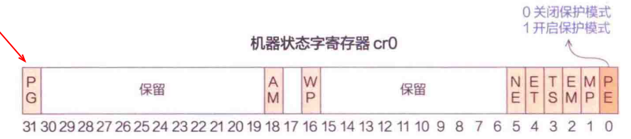
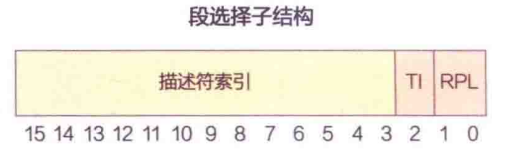
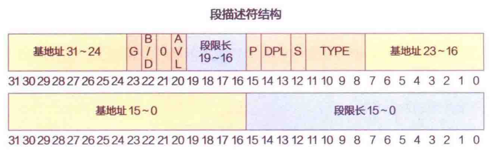
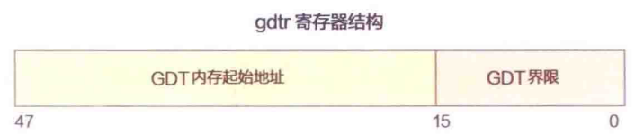
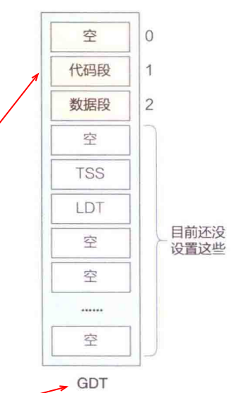
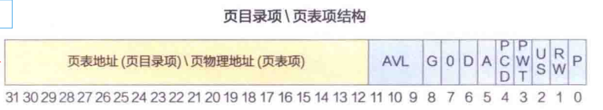
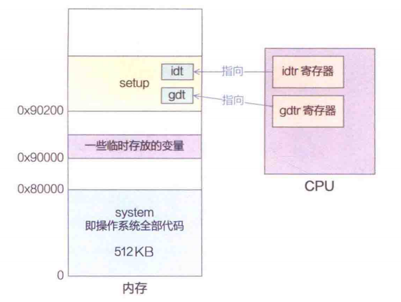

# 1.前情回顾
好了，我们上面完成了main函数里面的第一行代码：
```
ROOT_DEV = ORIG_ROOT_DEV;
```
的讲解，并在其中开枝散叶，完成了bootsect.s的讲解。在其中也说到，Linux的整体的执行流程为：bootsect->setup->head->main()。
但是本书是为了以**main为主线讲解**，我们这里其实是跳过了**setup.s、head.s**,直接来到了main的第一行代码。

但是，直接讲解setup.s、head.s其实是有点强行灌知识的意味，让人不适。于是，我绕了个弯子，把大的面给你说明白了，再来讲小的过程，你就会明白的多。

好了，接下来我们就来补全跳过的setup.s和head.s。

首先我们来看看setup.s的代码吧。

>我们还是遵循老方法，先讲清楚作用，在深挖作用背后的原理，最后在回扣源码，这样比强行灌输源码更容易理解。

# 2.setup.s功能及解释

## 2.1 功能
setup.s的功能很简单，就是完成一些元数据信息的保存，然后把CPU切换到保护模式下去。

2.1.1. 将重要的元信息，如光标位置等，文字显示模式等从0地址处复制到0x90000地址处。

2.1.2. 将system模块从0x10000地址处复制到0x00000地址处。

2.1.3. 从16位实模式切换到32位保护模式(需要提前设置好GDT)。

2.1.4. 跳转到0x00000地址处，开始执行system模块的代码。

## 2.2 解释

### 2.2.0. BIOS的功能再议
BIOS除了加载引导区外，还涉及了一些其他的功能，如：

- 初始化硬件设备（如磁盘、键盘、显示器等）

- 加载引导程序（如 GRUB）

- 提供 BIOS 中断服务（如打印字符、读取磁盘等）

而这些硬件信息会被保存在低地址处，中断服务就是调用这些硬件信息的入口，你可以把它看成一个函数，仅此而已。

### 2.2.1. 将重要的元信息，如光标位置等，文字显示模式等从0地址处复制到0x90000地址处。

开机后到 setup 阶段，所有硬件（显示器、磁盘、键盘）**都由 BIOS 统一管理（准确的说，BIOS启动后，会接管这些硬件）**，**光标位置**（第几行第几列）、**文字显示模式**（如 80×25 字符模式、显示分辨率、颜色属性）、**磁盘参数**（每磁道扇区数）等硬件状态信息，都由 BIOS **维护在低地址内存**（0 地址段，**BIOS 数据区**） 中。而内核启动后会**完全接管所有硬件的管理权**（**不再依赖 BIOS 中断**），如果丢失这些状态信息，内核将无法知道**当前显示器的工作模式、光标在哪**，后续无法正常打印内核日志、响应用户输入。

那么为什么需要将这些元数据信息复制0x90000地址处呢？一个大胆的猜测就是后面低地址处的数据会被覆盖，这一步就是覆盖之前的信息保留，供后续内核使用。

实际上，也确实如此，因为，setup执行的第二步，就是将我们的system模块移动到低地址处，完成覆盖！一切都说的通了！

### 2.2.2. 将system模块从0x10000地址处复制到0x00000地址处.
为什么需要将system模块从0x10000地址处复制到0x00000地址处？

这是因为，system 内核编译链接时，**编译器 / 链接器默认内核会在 0x00000 运行**，因此**代码中所有的全局变量、函数调用、内存引用都是「基于 0x00000 的偏移地址」**（比如函数main的地址是 0x0000xxxx）。如果直接在 0x10000 运行，**内核会因为「地址引用错误」直接崩溃**（比如想访问 0x00001234，实际访问到 0x10000+0x1234，读取到垃圾数据）。


### 2.2.3. 从16位实模式切换到32位保护模式(需要提前设置好GDT+将CR0寄存器的PE位置1)。
这是setup的关键，我们要把这点搞清楚不容易，慢慢来，先从CPU执行模式说起。

什么是CPU的执行模式？**就是CPU如何获得数据的物理地址的？** 这个简简单单的问题，实际涉及了悠久的历史。

在讲解各种模式之前，我们先来介绍一下CPU底层的模式切换原理。

#### 2.2.3.1 保存CPU重要元信息的CR0寄存器

CPU中有一个特别重要的寄存器——CR0寄存器。

> 开门见山，CPU 有3种执行模式：实模式、保护模式和分页模式。这三种模式涉及CPU的重要寄存器——**状态字寄存器CR0**的两个位：**PE、PG**。



|PE|PG|CPU执行模式|
|-|-|-|
|0|0|实模式（Real Mode）|
|1|0|保护模式（Protected Mode）|
|1|1|分页模式（Paging Mode）|

- **PE（Protection Enable）**：**保护使能位**，控制 CPU 是处于实模式还是**保护模式**。当 PE=0 时，CPU 处于实模式；当 PE=1 时，CPU 进入保护模式。

- **PG（Paging Enable）**：**分页使能位**，控制 CPU 是否启用**分页机制**。当 PG=0 时，CPU 不使用分页机制；当 PG=1 时，CPU 启用分页机制，进入分页模式。

> 所以我们看到，所谓CPU的各种执行模式，不过就是这几个位的开关而已，那么2^2=4才对，为啥只有3猴子那个模式？因为分页模式的基础是打开了保护模式。


#### 2.2.3.2 实模式
> PE=0,PG=0

实模式是 CPU 的**初始工作模式**，也是最简单的模式。在实模式下，**CPU 直接使用物理地址进行内存访问**，没有`任何内存保护机制`。实模式的内存寻址方式是通过**段寄存器和偏移地址**的组合来计算物理地址，**最大可寻址 1MB 内存（20 位地址总线）。**

又因为CPU按照pc寄存器里面的值作为执行地址，也就是说，对应关系为：

>pc=f(seg,ip) = seg << 4  + ip


#### 2.2.3.3段寄存器
那么这里seg段寄存器，在CPU内部是指的啥呢？

|seg段寄存器|作用|
|-|-|
|CS|代码段寄存器，存放当前执行代码所在的段地址|
|DS|数据段寄存器，存放当前数据所在的段地址|
|SS|栈段寄存器，存放当前栈所在的段地址|
|ES|额外数据段寄存器，存放当前额外数据所在的段地址|


#### 2.2.3.4 保护模式

> PE=1,PG=0

既然，实模式作为最初的模式，没有内存保护机制，所以理所当然的，保护模式就必须要开启。

----

保护模式是现代 CPU 的主要工作模式。在保护模式下，**CPU 使用段选择子和段描述符来进行内存访问**，具体来说，访问段寄存器里面的段选择子，将其值作为索引去访问**全局描述符表（GDT）**或**局部描述符表（LDT）**，获取对应的段描述符，然后根据段描述符中的基地址和偏移地址计算出物理地址。
保护模式相对于实模式为我们提供了**内存保护机制**。

那么提到了段选择子、段描述符、GDT、LDT等等，这些名词是指的啥？让我们慢慢来讲解：

##### 2.2.3.4.1 段寄存器的作用不同

在CPU中，有4个段寄存器：CS、DS、ES、SS。

那么在实模式上，这几个段寄存器里面存储的都是偏移地址，CPU直接将其右移4位，与偏移地址想加后，就直接得到了物理地址。

但是在保护模式下，这几个段寄存器里面存储的**不是偏移地址**，而是**段选择子**。

那么什么是段选择子呢？


##### 2.2.3.4.2 段选择子

段选择子是一个**16位的值**，作为索引，用于**选择GDT或LDT中的一个段描述符**。它的格式如下：



|字段|位数|作用|
|-|-|-|
|索引|3-15，13位|指向GDT或LDT中的一个段描述符|
|TI|2，1位|表指示位，0表示GDT，1表示LDT|
|RPL|0-1，2位|请求特权级，用于权限检查|


好了，这里又出现了一个**段描述符**、GDT、LDT等名词，啥是**段描述符**、GDT、LDT呢？我们依次讲解吧！

#### 2.2.3.5 段描述符

一句话：段描述符是一个**8字节**的结构体，用于**描述一个段的属性和权限。**



我们从低字节到高字节依次讲解段描述符里面的内容：
 ##### 2.2.3.5.1 基地址低16位


| 个数 | 字段 | 位数 | 作用 |
| :--- | :--- | :--- | :--- |
| 1 | 基地址低16位 | 0-15，16位 | 段基地址的**低16位**（bit15~bit0），与高16位拼接成32位基地址，定义段在内存的起始位置 |
| 2 | 限长低16位 | 16-31，16位 | 段限长的**低16位**（bit31~bit16），与高4位拼接成20位限长，控制段的最大长度 |
| 3 | 基地址中8位 | 32-39，8位 | 段基地址的**中8位**（bit39~bit32，原表“高8位”为笔误），衔接低16位与高8位，补全32位基地址 |
| 4 | TYPE | 40-43，4位 | 段的具体类型与访问权限：<br>• S=1（应用段）：区分代码段（只读/可执行/一致）、数据段（只读/读写/扩展）<br>• S=0（系统段）：定义TSS、LDT、调用门/中断门等系统段类型 |
| 5 | S | 44，1位 | 描述符类型位（原表“0/1”写反）：<br>• 0 = **系统段**（TSS、LDT、门描述符等，用于系统管理）<br>• 1 = **应用段**（代码段/数据段，用于程序代码和数据） |
| 6 | DPL | 45-46，2位 | 描述符特权级（0~3级）：<br>• 00（0级）= 内核态（最高权限）<br>• 01（1级）= 设备驱动<br>• 10（2级）= 系统服务<br>• 11（3级）= 用户态（最低权限）<br>CPU访问时校验当前特权级（CPL），权限不足触发#GP异常 |
| 7 | P | 47，1位 | 存在位：<br>• 0 = 段**未加载**到物理内存（可能在磁盘交换区），访问触发#NP（段不存在）异常<br>• 1 = 段**已加载**，可正常访问，是虚拟内存的核心控制位 |
| 8 | 基地址高8位 | 48-55，8位 | 段基地址的**高8位**（bit55~bit48），与中8位、低16位拼接，最终形成**32位段基地址**（0x00000000~0xFFFFFFFF） |
| 9 | 限长高4位 | 56-59，4位 | 段限长的**高4位**（bit59~bit56，原表“56-63”为笔误），与低16位拼接成**20位段限长**（0x00000~0xFFFFF） |
| 10 | AVL | 60，1位 | 系统软件可用位：CPU不使用，供操作系统/编译器自定义标记段属性 |
| 11 | 0 | 61，1位 | 保留位：必须置0，CPU忽略该位，无实际功能 |
| 12 | B/D | 62，1位 | 默认操作数大小位：<br>• 代码段（D位）：0=16位操作数/地址，1=32位操作数/地址<br>• 数据段（B位）：0=16位栈指针（SP），1=32位栈指针（ESP） |
| 13 | G | 63，1位 | 粒度位：<br>• 0 = 段限长以**字节**为单位（最大1MB）<br>• 1 = 段限长以**4KB（页）**为单位（最大4GB） |

---
 

##### 2.2.3.5.2 核心拼接公式（必记）

- **32位段基地址** = 基地址高8位(48-55) + 基地址中8位(32-39) + 基地址低16位(0-15)

- **20位段限长** = 限长高4位(56-59) + 限长低16位(16-31)

- **段实际长度** = 段限长 × (G=0?1字节:4KB)

好了，有了段描述符，我们就能知道段的基地址了！然后通过下述公式计算物理地址：

>PC=f(seg,ip)=gdt(seg)中的段基地址组合+ip

#### 2.2.3.6 GDT
GDT全称为 global descripter table，即全局描述符表。GDT 是一个**段描述符数组**，即里面存着一大堆上面提到的描述符。上文也说到，每个段描述符占用 8 字节（64 位），用于描述不同的内存段（代码段、数据段、堆栈段等）。

##### 2.2.3.6.1 在哪里找这个表？=>gdtr寄存器
这个表的起始地址存在gdtr寄存器里面，即global descripter table register，该寄存器的结构如下：



好了，知道了在哪里找它，现在我们来看看，这个表到底长什么样子？

##### 2.2.3.6.2 GDT结构图
给出GDT的结构图:



由此可以看出，每一份GDT表项，都对应着一个物理地址的段描述符。


#### 2.2.3.7 LDT

好了，知道了GDT长什么样子，现在我们来看看LDT长什么样子。

LDT和GDT很类似，全称为local describe table，叫做局部描述符表。里面存着的依然是描述符，和GDT里面的一模一样。
只不过，一个是给内核代码使用，一个是给用户自己编写的代码使用的。

#### 2.2.3.8 描述符如何区分GDT、LDT？

先给出段描述符的结构：


具体区分如下：

- 看S 位（位 12）：
S=1 → 代码 / 数据段（非 GDT/LDT 表项）
S=0 → 系统段，继续看 TYPE 位
- 看TYPE 位（位 8~11）：
TYPE=0001 → GDT 表项
TYPE=0010 → LDT 表项
其他 TYPE 值 → 其他系统段（如 TSS、调用门等）

#### 2.2.3.9 TSS

我们看到，在GDT表里面，紧接着LDT，存着一个TSS结构，这是啥？

TSS ,即task segment state，即任务的上下文信息。也即，在内核进程中的上下问信息结构体成员`tss_struct`的信息。用于保存进程切换前的状态，方便恢复进程状态。
```c
struct tss_struct {
	long	back_link;	/* 16 high bits zero */
	long	esp0;
	long	ss0;		/* 16 high bits zero */
	long	esp1;
	long	ss1;		/* 16 high bits zero */
	long	esp2;
	long	ss2;		/* 16 high bits zero */
	long	cr3;
	long	eip;
	long	eflags;
	long	eax,ecx,edx,ebx;
	long	esp;
	long	ebp;
	long	esi;
	long	edi;
	long	es;		/* 16 high bits zero */
	long	cs;		/* 16 high bits zero */
	long	ss;		/* 16 high bits zero */
	long	ds;		/* 16 high bits zero */
	long	fs;		/* 16 high bits zero */
	long	gs;		/* 16 high bits zero */
	long	ldt;		/* 16 high bits zero */
	long	trace_bitmap;	/* bits: trace 0, bitmap 16-31 */
	struct i387_struct i387;
};
```
由此可见，我们用户编写的程序，通过LDT表项定位物理地址，通过TSS保存上下文。而这两个东西，都存在GDT表里面！


#### 2.2.3.8 为啥叫保护模式？

保护模式相对于实模式的最大优势就是**内存保护机制**。

内存保护机制通过**段描述符中的DPL（描述符特权级）和P（存在位）**来实现：

- **DPL（描述符特权级）**：定义了段的访问权限，CPU 在访问内存时会检查当前特权级（CPL）是否满足段的 DPL 要求，权限不足会触发异常，防止非法访问。

- **P（存在位）**：定义了段是否存在于物理内存中，0 表示段不存在（可能在磁盘交换区），1 表示段已加载到物理内存，可正常访问。

通过这些机制，保护模式能够有效防止程序越权访问内存，保障系统的稳定性和安全性。

----
在此，我们先总结一下实模式、保护模式(未开启分页)下的内存管理方式：

|CPU执行模式|内存管理方式|解释|
|-|-|-|
|实模式|分段寻址|是8086实模式的寻址方式，存在您列出的所有问题。|
|保护模式(未开启分页)|段式内存管理|是保护模式下操作系统利用分段硬件提供的内存管理方案，它解决了保护、隔离等问题（但仍存在碎片问题）。|

其实，仅仅通过开启保护模式，启动特权级访问，确实可以解决一些安全问题，但是也有段式管理与生俱来的一些毛病:

##### 2.2.3.8.1 内存碎片严重

分段模式的段长度可变，导致**外部碎片严重**。|

##### 2.2.3.8.2 分段交换开销大

分段在交换时，**交换整个段（可能很大，几MB）到磁盘，I/O开销大。**

同时，如果只需要访问段中的一小部分，也必须加载整个段。

##### 2.2.3.8.3 地址空间布局不够灵活

段有基址和界限，程序的不同部分（代码、数据、堆、栈）**必须连续存放。**

##### 2.2.3.8.4 内存管理（对操作系统）复杂

OS需要管理不同大小的内存块，类似动态分区分配，算法复杂。


好了，有这么多问题，我们这才引出了分页模式：

>也就是说，上面的问题，**分页模式都可以解决。**

#### 2.2.3.9 分页模式
> PE=1,PG=1

分页模式是在保护模式的基础上，进一步启用分页机制的工作模式。在分页模式下，**内存被划分为固定大小的页（通常为 4KB）**，并通过页表进行虚拟地址到物理地址的映射。

正是因为上面的分段寻址和段式内存管理模式的缺点，我们要想让整个操作系统高效，就必须还要有分页模式：

>不要忘记，我们所有的执行模式，都是解决一个问题：CPU如何得到物理地址。

那么既然分页模式需要再分段模式下，进一步开启分页功能，所以上述分段模式下得到的最后的地址，就不是物理地址，开启分页模式后，我们叫做：线性地址。

在分页模式下，会将32位线性地址转化为：

>高10位，中10位，低12位

|线性地址被划分为3部分|各部分的功能|
|-|-|
|高10位|用于索引页目录，找到对应的页目录项（PDE）。|
|中间10位|用于具体索引页表，找到对应的页表项（PTE）。将PTE里面的**页框号左移12位得到物理页框号**。|
|低12位|偏移地址，与PTE中对应的页框号左移12位得到物理页框号想加，得到物理地址。|
 
那么这里出现了PDE(页目录项)、PTE(页表项)，这都是些啥结构？

---

##### 2.2.3.9.1 页目录项（PDE）



PDE 是**页目录表中的条目**，用于定位**页表**的**物理地址**，核心字段如下（从高位到低位，对应图中 31~0 位）：
 
| 字段 | 位位置 | 核心解释 |
|------|--------|----------|
| **页表地址** | 31~12 | 存储**页表的物理基地址**（页表按4KB对齐，**低12位为0，仅高20位为有效地址**），CPU据此找到**对应页表**。 |
| **AVL** | 11~9 | 操作系统/软件自定义位，硬件不使用，可用于存储页表管理的额外信息。 |
| **G** | 8 | 全局位，置1时该页表项对应的页为**全局页**，TLB刷新时不失效（用于内核等全局共享页）。 |
| **0** | 7 | 保留位，必须为0，硬件未定义用途。 |
| **D** | 6 | 脏位，置1表示该页表**已被修改**（页表本身的写操作，非页内数据），仅PDE有此位。 |
| **A** | 5 | 访问位，置1表示该页表**已被访问**（CPU读取PDE时自动置1），用于页替换算法。 |
| **PCD** | 4 | 页缓存禁用位，置1时该页表**不使用CPU缓存**，直接访问内存（用于MMIO等不可缓存区域）。 |
| **PWT** | 3 | 页写通位，置1时该页表采用**写通缓存策略**（写操作同时更新缓存和内存），0为写回策略。 |
| **U/S** | 2 | 用户/超级用户位，置1时**用户态程序可访问**该页表，0仅内核态（超级用户）可访问。 |
| **R/W** | 1 | 读写位，置1时该页表**可读写**，0为只读（写操作触发页异常）。 |
| **P** | 0 | 存在位，置1表示该**页表已加载到物理内存**，0表示页表不在内存（触发缺页异常）。 |

---
##### 2.2.3.9.2 页表项（PTE）

| 字段 | 位位置 | 核心解释 |
|------|--------|----------|
| **页物理地址** | 31~12 | 存储**物理页的基地址**（物理页按4KB对齐，**低12位为0，仅高20位为有效地址**），CPU据此找到线性地址对应的**物理内存页**。 |
| **AVL** | 11~9 | 操作系统/软件自定义位，硬件不使用，可存储页的额外属性（如页类型、权限扩展）。 |
| **G** | 8 | 全局位，置1时该物理页为**全局页**，TLB刷新时不失效（内核全局页常用）。 |
| **0** | 7 | 保留位，必须为0，硬件未定义用途。 |
| **D** | 6 | 脏位，置1表示该**物理页已被修改**（页内数据写操作触发），用于写回内存时判断是否需要刷盘。 |
| **A** | 5 | 访问位，置1表示该**物理页已被访问**（CPU读取/写入页内数据时自动置1），用于页替换算法（如LRU）。 |
| **PCD** | 4 | 页缓存禁用位，置1时该物理页**不使用CPU缓存**，直接访问内存（用于MMIO、设备寄存器等）。 |
| **PWT** | 3 | 页写通位，置1时该物理页采用**写通缓存策略**，0为写回策略（写操作先更新缓存，后续批量写回内存）。 |
| **U/S** | 2 | 用户/超级用户位，置1时**用户态程序可访问**该物理页，0仅内核态可访问（保护内核内存）。 |
| **R/W** | 1 | 读写位，置1时该物理页**可读写**，0为只读（用户态写只读页触发页异常，内核态可忽略）。 |
| **P** | 0 | 存在位，置1表示该**物理页已加载到内存**，0表示页在磁盘（触发缺页异常，由操作系统加载）。 |

---

#### 2.2.3.10 关键区别（PDE vs PTE）
1. **地址指向**：PDE 指向**页表**，PTE 指向**物理页**；
2. **D 位含义**：PDE 的 D 位是**页表本身的脏位**，PTE 的 D 位是**物理页数据的脏位**；
3. **核心作用**：PDE 完成**虚拟地址→页表”的一级映射**，PTE 完成**虚拟地址→物理页”的二级映射**。

---

#### 2.2.3.11 为什么说分页模式下，可以解决内存碎片问题？

这是一个很好的问题。分页模式本身**并不直接“解决”传统意义上的外部内存碎片问题**，而是通过一种**根本性的设计**，彻底**避免了外部碎片的产生**，从而让“碎片问题”不复存在。

为了理解这一点，我们需要区分两种碎片，并对比分页和分段两种内存管理方式。

##### 2.2.3.11.1. 两种内存碎片
- **内部碎片**：指分配给进程的**内存块内部**未被使用的部分。例如，进程申请了100KB，系统分配了128KB的固定块，那28KB就是内部碎片。
- **外部碎片**：指内存中分散的、**总空间足够但无法被利用**的小块空闲内存。例如，内存中有三块不连续的50MB空闲空间，但一个需要120MB的进程却无法被加载，因为这些空闲空间不连续。

**传统意义上的“碎片问题”通常指的是外部碎片。**

##### 2.2.3.11.2. 分段模式下的碎片问题（对比才能理解）
在分段模式下，内存被划分成**长度不等的逻辑段**（如代码段、数据段、堆栈段）。系统为每个段寻找一块连续的物理内存。
- **问题**：随着进程的加载和卸载，内存中会留下许多**大小不一的空闲孔洞**。
- **后果**：即使所有空闲孔洞的总和大于新进程所需，但因为它们不连续，新进程也无法加载。这就是**外部碎片**。
- **解决方案（代价高昂）**：操作系统需要定期进行**内存压缩**，即移动所有已分配的内存，把空闲区域合并成一大块连续空间。这个过程非常耗时，且会降低系统性能。

##### 2.2.3.11.3. 分页模式如何“解决”（更准确说是“避免”）碎片问题
分页模式采用了一种完全不同的思路：

1. **物理内存等分**：将物理内存划分为一系列**大小固定、相等的小单元**，称为**页框**。
2. **逻辑地址等分**：将进程的逻辑地址空间也划分为同样大小的单元，称为**页**。
3. **地址映射机制**：操作系统为每个进程维护一张**页表**。页表的作用是：将进程的**逻辑页号**映射到物理内存的**任意物理页框号**。

##### 2.2.3.11.4 关键特性：
- **连续性要求的消除**：一个进程的多个页，**不需要**在物理内存中连续存放。第一页可以在页框10，第二页可以在页框50，第三页可以在页框5。
- **分配粒度小**：以页（通常是4KB）为单位进行分配，远小于分段中的整个段（可能是几MB或几GB）。

##### 2.2.3.11.5  为什么没有外部碎片？
- **空闲管理简单**：系统只需要维护一个**空闲页框列表**。当需要为新页分配内存时，只需从列表中取出**任何一个**空闲页框即可。
- **“总空间足够即可分配”**：只要空闲页框的**总数**大于等于进程所需的页数，无论这些页框在物理上位于何处（0x1000, 0x5000, 0xA000...），进程都能被成功加载。页表负责建立这些不连续的页框与连续逻辑地址空间的映射关系。
- **没有“无法利用的小洞”**：最小的分配单元是页框。一个页框要么完全空闲，要么完全被占用。任何空闲页框对任何需要一页的请求都同样可用。不存在“一个50KB的请求，但最大空闲块只有49KB”的情况（除非进程总需求小于一页，但那是内部碎片）。

##### 2.2.3.11.6  付出的代价：内部碎片
分页模式并非完美，它用**内部碎片**替代了**外部碎片**。
- 进程的最后一个页很少能完全填满。平均而言，每个进程会浪费**半页**大小的内存。
- 例如，一个大小为10.1KB的进程，在4KB的页大小下，需要3个页（12KB），其中有大约1.9KB的内部碎片。
- **权衡**：这是一个经过深思熟虑的权衡。内部碎片是可预测、可管理的（浪费量≤页大小），而且不会像外部碎片那样导致系统无法分配内存。通过选择合理的页大小（如4KB），可以将内部碎片的平均开销控制在可接受的范围内。

##### 2.2.3.11.7 总结
| 特性 | 分段 | 分页 |
| :--- | :--- | :--- |
| **内存划分** | 长度可变的逻辑段 | 固定大小的页 |
| **连续性要求** | **需要**连续物理内存 | **不需要**连续物理内存 |
| **主要碎片** | **外部碎片**严重 | **内部碎片**（少量可控） |
| **碎片“解决”** | 需要内存压缩（耗时） | **通过设计根本避免** |
| **分配粒度** | 大（整个段） | 小（单个页） |

因此，准确的说法是：**分页内存管理模式通过取消进程内存必须连续的硬性要求，并辅以固定大小的页分配机制，彻底消除了外部内存碎片产生的条件，从而解决了外部碎片导致内存无法有效利用的根本问题。** 这是现代操作系统（如Linux, Windows, macOS）普遍采用分页机制的核心原因之一。


### 2.2.4. 跳转到0x00000地址处，开始执行system模块的代码。

这是理所当然的，执行流就是BIOS->bootsect->setup->system。所以在setup.S中，我们需要跳转到0x00000地址处，开始执行system模块的代码。


# 3. setup.S源码讲解

好了，我们终于讲解完了setup的4个功能，在期间也解释了各个专业术语，例如实模式、保护模式、分页模式、GDT、LDT、TSS等等。
现在，有了这些知识，我们终于可以从源码层面来查看这些功能的实现了！

老规矩，先给出所有源码，再逐一讲解！

## 3.1 setup.S全部源码
```s
	.code16
	.equ INITSEG, 0x9000	# we move boot here - out of the way
	.equ SYSSEG, 0x1000	# system loaded at 0x10000 (65536).
	.equ SETUPSEG, 0x9020	# this is the current segment

	.global _start, begtext, begdata, begbss, endtext, enddata, endbss
	.text
	begtext:
	.data
	begdata:
	.bss
	begbss:
	.text

	ljmp $SETUPSEG, $_start	
_start:
	mov %cs,%ax
	mov %ax,%ds
	mov %ax,%es

# print some message

	mov $0x03, %ah
	xor %bh, %bh
	int $0x10

	mov $29, %cx
	mov $0x000b,%bx
	mov $msg2,%bp
	mov $0x1301, %ax
	int $0x10
# ok, the read went well so we get current cursor position and save it for
# posterity.
	mov	$INITSEG, %ax	# this is done in bootsect already, but...
	mov	%ax, %ds
	mov	$0x03, %ah	# read cursor pos
	xor	%bh, %bh
	int	$0x10		# save it in known place, con_init fetches
	mov	%dx, %ds:0	# it from 0x90000.
# Get memory size (extended mem, kB)

	mov	$0x88, %ah 
	int	$0x15
	mov	%ax, %ds:2

# Get video-card data:

	mov	$0x0f, %ah
	int	$0x10
	mov	%bx, %ds:4	# bh = display page
	mov	%ax, %ds:6	# al = video mode, ah = window width

# check for EGA/VGA and some config parameters

	mov	$0x12, %ah
	mov	$0x10, %bl
	int	$0x10
	mov	%ax, %ds:8
	mov	%bx, %ds:10
	mov	%cx, %ds:12

# Get hd0 data

	mov	$0x0000, %ax
	mov	%ax, %ds
	lds	%ds:4*0x41, %si
	mov	$INITSEG, %ax
	mov	%ax, %es
	mov	$0x0080, %di
	mov	$0x10, %cx
	rep
	movsb

# Get hd1 data

	mov	$0x0000, %ax
	mov	%ax, %ds
	lds	%ds:4*0x46, %si
	mov	$INITSEG, %ax
	mov	%ax, %es
	mov	$0x0090, %di
	mov	$0x10, %cx
	rep
	movsb

# modify ds
	mov $INITSEG,%ax
	mov %ax,%ds
	mov $SETUPSEG,%ax
	mov %ax,%es

#show cursor pos:
	mov $0x03, %ah 
	xor %bh,%bh
	int $0x10
	mov $11,%cx
	mov $0x000c,%bx
	mov $cur,%bp
	mov $0x1301,%ax
	int $0x10

#show detail
	mov %ds:0 ,%ax
	call print_hex
	call print_nl

#show memory size
	mov $0x03, %ah
	xor %bh, %bh
	int $0x10
	mov $12, %cx
	mov $0x000a, %bx
	mov $mem, %bp
	mov $0x1301, %ax
	int $0x10

#show detail
	mov %ds:2 , %ax
	call print_hex

#show 
	mov $0x03, %ah
	xor %bh, %bh
	int $0x10
	mov $25, %cx
	mov $0x000d, %bx
	mov $cyl, %bp
	mov $0x1301, %ax
	int $0x10
 
	mov %ds:0x80, %ax
	call print_hex
	call print_nl

 
	mov $0x03, %ah
	xor %bh, %bh
	int $0x10
	mov $8, %cx
	mov $0x000e, %bx
	mov $head, %bp
	mov $0x1301, %ax
	int $0x10
 
	mov %ds:0x82, %ax
	call print_hex
	call print_nl

 
	mov $0x03, %ah
	xor %bh, %bh
	int $0x10
	mov $8, %cx
	mov $0x000f, %bx
	mov $sect, %bp
	mov $0x1301, %ax
	int $0x10
 
	mov %ds:0x8e, %ax
	call print_hex
	call print_nl
 
	mov	$0x01500, %ax
	mov	$0x81, %dl
	int	$0x13
	jc	no_disk1
	cmp	$3, %ah
	je	is_disk1
no_disk1:
	mov	$INITSEG, %ax
	mov	%ax, %es
	mov	$0x0090, %di
	mov	$0x10, %cx
	mov	$0x00, %ax
	rep
	stosb
is_disk1:

# now we want to move to protected mode ...

	cli			# no interrupts allowed ! 

# first we move the system to its rightful place

	mov	$0x0000, %ax
	cld			# 'direction'=0, movs moves forward
do_move:
	mov	%ax, %es	# destination segment
	add	$0x1000, %ax
	cmp	$0x9000, %ax
	jz	end_move
	mov	%ax, %ds	# source segment
	sub	%di, %di
	sub	%si, %si
	mov 	$0x8000, %cx
	rep
	movsw
	jmp	do_move

# then we load the segment descriptors

end_move:
	mov	$SETUPSEG, %ax	# right, forgot this at first. didnt work :-)
	mov	%ax, %ds
	lidt	idt_48		# load idt with 0,0
	lgdt	gdt_48		# load gdt with whatever appropriate


	inb     $0x92, %al	# open A20 line(Fast Gate A20).
	orb     $0b00000010, %al
	outb    %al, $0x92

	mov	$0x11, %al		# initialization sequence(ICW1)
					# ICW4 needed(1),CASCADE mode,Level-triggered
	out	%al, $0x20		# send it to 8259A-1
	.word	0x00eb,0x00eb		# jmp $+2, jmp $+2
	out	%al, $0xA0		# and to 8259A-2
	.word	0x00eb,0x00eb
	mov	$0x20, %al		# start of hardware int's (0x20)(ICW2)
	out	%al, $0x21		# from 0x20-0x27
	.word	0x00eb,0x00eb
	mov	$0x28, %al		# start of hardware int's 2 (0x28)
	out	%al, $0xA1		# from 0x28-0x2F
	.word	0x00eb,0x00eb		#               IR 7654 3210
	mov	$0x04, %al		# 8259-1 is master(0000 0100) --\
	out	%al, $0x21		#				|
	.word	0x00eb,0x00eb		#			 INT	/
	mov	$0x02, %al		# 8259-2 is slave(       010 --> 2)
	out	%al, $0xA1
	.word	0x00eb,0x00eb
	mov	$0x01, %al		# 8086 mode for both
	out	%al, $0x21
	.word	0x00eb,0x00eb
	out	%al, $0xA1
	.word	0x00eb,0x00eb
	mov	$0xFF, %al		# mask off all interrupts for now
	out	%al, $0x21
	.word	0x00eb,0x00eb
	out	%al, $0xA1


	mov	%cr0, %eax	# get machine status(cr0|MSW)	
	bts	$0, %eax	# turn on the PE-bit 
	mov	%eax, %cr0	# protection enabled
				
				# segment-descriptor        (INDEX:TI:RPL)
	.equ	sel_cs0, 0x0008 # select for code segment 0 (  001:0 :00) 
	ljmp	$sel_cs0, $0	# jmp offset 0 of code segment 0 in gdt

empty_8042:
	.word	0x00eb,0x00eb
	in	$0x64, %al	# 8042 status port
	test	$2, %al		# is input buffer full?
	jnz	empty_8042	# yes - loop
	ret

gdt:
	.word	0,0,0,0		# dummy

	.word	0x07FF		# 8Mb - limit=2047 (2048*4096=8Mb)
	.word	0x0000		# base address=0
	.word	0x9A00		# code read/exec
	.word	0x00C0		# granularity=4096, 386

	.word	0x07FF		# 8Mb - limit=2047 (2048*4096=8Mb)
	.word	0x0000		# base address=0
	.word	0x9200		# data read/write
	.word	0x00C0		# granularity=4096, 386

idt_48:
	.word	0			# idt limit=0
	.word	0,0			# idt base=0L

gdt_48:
	.word	0x800			# gdt limit=2048, 256 GDT entries
	.word   512+gdt, 0x9		# gdt base = 0X9xxxx, 
	# 512+gdt is the real gdt after setup is moved to 0x9020 * 0x10
print_hex:
	mov $4,%cx
	mov %ax,%dx

print_digit:
	rol $4,%dx	#循环以使低4位用上，高4位移至低4位
	mov $0xe0f,%ax #ah ＝ 请求的功能值，al = 半个字节的掩码
	and %dl,%al
	add $0x30,%al
	cmp $0x3a,%al
	jl outp
	add $0x07,%al

outp:
	int $0x10
	loop print_digit
	ret
#打印回车换行
print_nl:
	mov $0xe0d,%ax
	int $0x10
	mov $0xa,%al
	int $0x10
	ret

msg2:
	.byte 13,10
	.ascii "Now we are in setup ..."
	.byte 13,10,13,10
cur:
	.ascii "Cursor POS:"
mem:
	.ascii "Memory SIZE:"
cyl:
	.ascii "KB"
	.byte 13,10,13,10
	.ascii "HD Info"
	.byte 13,10
	.ascii "Cylinders:"
head:
	.ascii "Headers:"
sect:
	.ascii "Secotrs:"
.text
endtext:
.data
enddata:
.bss
endbss:
```
## 3.2 逐一精讲setup.S文件
#### 3.2.1汇编形式的宏定义
```s
	.code16
    # 告诉汇编器生成 16 位实模式代码。
	.equ INITSEG, 0x9000	
    # bootsect数据块的起始位置
	.equ SYSSEG, 0x1000	
    # system数据块的起始位置
	.equ SETUPSEG, 0x9020	
    # setup数据块的起始位置

    # 注意上面这三条必须和bootsect.S中的定义一致，因为 bootsect 会将 setup 和 system 加载到这些位置。

    # 定义全局符号，供链接器使用。
	.global _start, begtext, begdata, begbss, endtext, enddata, endbss
    # 声明代码段（.text）、数据段（.data）、未初始化数据段（.bss）的起止位置。

	.text       # .text 是 GNU 汇编器（as）的伪指令，表示接下来的内容属于代码段（存放可执行指令，即编译好的机器码）。
	begtext:    # begtext: 是一个标签，标记代码段的起始地址。通常，代码段是只读的，CPU 从这里取指令执行。
	.data       # .data 表示接下来的内容是已初始化的数据段（存放程序中显式初始化的全局变量、静态变量等）。
	begdata:    # begdata: 是数据段的起始标签。这部分数据在程序加载时会被写入内存的指定值（例如 int x = 42;）。
	.bss        # .bss 表示未初始化的数据段（存放未显式初始化的全局变量、静态变量，如 int y;）。         
	begbss:     # begbss: 是 BSS 段的起始标签。实际运行时，操作系统会将这段内存清零（因此不需要在文件中存储大量零值，节省空间）。其实，这个段的名字可以叫做：better save space=>BSS
	.text       # .text重新切换回代码段，表示后续内容是代码（例如 _start 标签后的指令）。
```

#### 3.2.2 跳转到setup的_start标签处，开始执行setup代码
```s
    ljmp $SETUPSEG, $_start # 显然跳转到0x90200处开始执行。
    # ljmp 是“长跳转”（long jump）的意思，允许跨段跳转。
    # CS设置为了$SETUPSEG,为0x90200(setup.s的段)，IP设置为了$_start，从这里具体执行。
```
### 功能1：将重要的元信息，如光标位置等，文字显示模式等从0地址处复制到0x90000地址处。

#### 3.2.3 setup的_start标签处的代码讲解
总体来说，下面这段代码收集计算机**硬件核心信息并保存**、可视化展示这些信息，**同时做进入保护模式的前期准备**（检查硬盘、关闭中断、初始化内存搬运参数）。

```s
_start:

# 将 CS 值复制到 DS 和 ES，使数据段和附加段指向当前代码段（方便后续访问数据）。
	mov %cs,%ax
	mov %ax,%ds
	mov %ax,%es

# print some message
# 使用 BIOS int 0x10 显示字符串：
# 先调用 AH=0x03 获取当前光标位置（用于后续保存）。
# 然后 AH=0x13 是“写字符串”功能：
# AL=0x01：字符串包含属性，光标移动。
# BH=0：显示页 0。
# BL=0x0b：浅青色前景，黑色背景。
# CX=29：字符串长度。
# BP=msg2：字符串地址。
# 显示内容："Now we are in setup ..."
	mov $0x03, %ah
	xor %bh, %bh
	int $0x10

	mov $29, %cx
	mov $0x000b,%bx
	mov $msg2,%bp
	mov $0x1301, %ax
	int $0x10

# 保存光标位置到 0x90000
# 为啥能够知道光标位置？这是BIOS读取的硬件信息。知识屏蔽，我们可以不管。
	mov	$INITSEG, %ax	# this is done in bootsect already, but...
	mov	%ax, %ds
	mov	$0x03, %ah	    # read cursor pos
	xor	%bh, %bh
	int	$0x10		    # save it in known place, con_init fetches
	mov	%dx, %ds:0	    # it from 0x90000.

# 保存内存大小（扩展内存，单位：KB），到 0x90002
	mov	$0x88, %ah 
	int	$0x15
	mov	%ax, %ds:2

# 将显卡信息分别存入 0x90004（页）和 0x90006（模式+宽度）。
	mov	$0x0f, %ah
	int	$0x10
	mov	%bx, %ds:4	# bh = display page
	mov	%ax, %ds:6	# al = video mode, ah = window width

# 检查 EGA/VGA 并获取配置参数，存入 0x90008-0x9000c
# 啥是 EGA/VGA？=> 是 IBM 公司开发的一种视频显示卡，支持 80x25 字符模式和 320x200 像素模式。
	mov	$0x12, %ah
	mov	$0x10, %bl
	int	$0x10
	mov	%ax, %ds:8
	mov	%bx, %ds:10
	mov	%cx, %ds:12

# 获取硬盘 0（hd0）参数,将其从 BIOS 表复制到 0x90080。
	mov	$0x0000, %ax
	mov	%ax, %ds
	lds	%ds:4*0x41, %si
	mov	$INITSEG, %ax
	mov	%ax, %es
	mov	$0x0080, %di
	mov	$0x10, %cx
	rep
	movsb

# 获取硬盘 1（hd1）参数，将其从 BIOS 表复制到 0x90090。
	mov	$0x0000, %ax
	mov	%ax, %ds
	lds	%ds:4*0x46, %si
	mov	$INITSEG, %ax
	mov	%ax, %es
	mov	$0x0090, %di
	mov	$0x10, %cx
	rep
	movsb

# 恢复段寄存器为 INITSEG
	mov $INITSEG,%ax
	mov %ax,%ds
	mov $SETUPSEG,%ax
	mov %ax,%es

# 显示光标位置
	mov $0x03, %ah 
	xor %bh,%bh
	int $0x10
	mov $11,%cx
	mov $0x000c,%bx
	mov $cur,%bp
	mov $0x1301,%ax
	int $0x10
	mov %ds:0 ,%ax
	call print_hex
	call print_nl

# 显示内存大小（扩展内存，单位：KB）
	mov $0x03, %ah
	xor %bh, %bh
	int $0x10
	mov $12, %cx
	mov $0x000a, %bx
	mov $mem, %bp
	mov $0x1301, %ax
	int $0x10
	mov %ds:2 , %ax
	call print_hex

# 显示硬盘 0（hd0）参数的详细信息

# 显示柱面
	mov $0x03, %ah
	xor %bh, %bh
	int $0x10
	mov $25, %cx
	mov $0x000d, %bx
	mov $cyl, %bp
	mov $0x1301, %ax
	int $0x10
	mov %ds:0x80, %ax
	call print_hex
	call print_nl

# 显示磁头
	mov $0x03, %ah
	xor %bh, %bh
	int $0x10
	mov $8, %cx
	mov $0x000e, %bx
	mov $head, %bp
	mov $0x1301, %ax
	int $0x10
	mov %ds:0x82, %ax
	call print_hex
	call print_nl

# 显示磁头扇区
	mov $0x03, %ah
	xor %bh, %bh
	int $0x10
	mov $8, %cx
	mov $0x000f, %bx
	mov $sect, %bp
	mov $0x1301, %ax
	int $0x10
	mov %ds:0x8e, %ax
	call print_hex
	call print_nl

# 检查是否存在 hd1

	mov	$0x01500, %ax
	mov	$0x81, %dl
	int	$0x13
	jc	no_disk1
	cmp	$3, %ah
	je	is_disk1

no_disk1:
	mov	$INITSEG, %ax
	mov	%ax, %es
	mov	$0x0090, %di
	mov	$0x10, %cx
	mov	$0x00, %ax
	rep
	stosb

is_disk1:

```
### 功能2：将system模块从0x10000地址处复制到0x00000地址处。
#### 3.2.4 关闭中断将system移动到0x00000
```s
    # 关中断并移动 system 代码到正确位置0x00000
	cli			
	mov	$0x0000, %ax
	cld			

    # 开始移动
do_move:
	mov	%ax, %es	# destination segment
	add	$0x1000, %ax
	cmp	$0x9000, %ax
	jz	end_move
	mov	%ax, %ds	# source segment
	sub	%di, %di
	sub	%si, %si
	mov 	$0x8000, %cx
	rep
	movsw
	jmp	do_move
```

#### 3.2.5 恢复移动后Linus的自嘲
第一行语句中，写到`right, forgot this at first. didn't work :-)`，可见，即便强如linus，也有疏忽的时候。他记载自己最初漏掉了这步，导致 lgdt 加载了错误的 GDT 地址，系统崩溃，后来修复时自嘲“didn't work”。

```s
    # 结束移动
end_move:
	mov	$SETUPSEG, %ax	# right, forgot this at first. didn't work :-)， Linus 的注释：他最初可能漏掉了这步，导致 lgdt 加载了错误的 GDT 地址，系统崩溃，后来修复时自嘲“didn't work”。
    
	mov	%ax, %ds        # 恢复 DS = SETUPSEG。如果没有恢复 DS，后续的 lidt 和 lgdt 会错误地从 DS=0x9000 计算地址，导致加载错误的 GDT/IDT。

    # lidt [idt_48]：加载 IDT（中断描述符表），初始为空（limit=0）。
    # lgdt [gdt_48]：加载 GDT（全局描述符表），地址为 0x90200 + gdt。
	lidt	idt_48		# load idt with 0,0
	lgdt	gdt_48		# load gdt with whatever appropriate
```

#### 3.2.6 A20地址线的操作
接下来进行如下操作：
1️⃣ 开启 A20 地址线（突破 1MB 内存限制）
2️⃣ 重编程 8259 中断控制器（避免 BIOS 中断冲突）
3️⃣ 切换到保护模式（通过设置 CR0 寄存器）
4️⃣ 跳转到内核入口点（32 位代码）

```s
# 开启A20地址线，本质就是向端口写数据(CPU操作其他设备的本质就是读写端口)

	inb     $0x92, %al	# open A20 line(Fast Gate A20).
	orb     $0b00000010, %al
	outb    %al, $0x92

# 实际上，这是较为现代化的操作，直接写端口，之前的传统操作如下，很复杂，而且还需要使用辅助函数empty_8042：
	
    #call	empty_8042	# 8042 is the keyboard controller
	#mov	$0xD1, %al	# command write
	#out	%al, $0x64
	#call	empty_8042
	#mov	$0xDF, %al	# A20 on
	#out	%al, $0x60
	#call	empty_8042

# 背景：
# BIOS 默认将硬件中断映射到 INT 0x08-0x0F，但这些与 CPU 内部异常（如 INT 0x0D 通用保护错误）冲突。
# 需将硬件中断重映射到 INT 0x20-0x2F（避开异常）。

	mov	$0x11, %al		# initialization sequence(ICW1)
					# ICW4 needed(1),CASCADE mode,Level-triggered
	out	%al, $0x20		# send it to 8259A-1
	.word	0x00eb,0x00eb		# jmp $+2, jmp $+2
	out	%al, $0xA0		# and to 8259A-2
	.word	0x00eb,0x00eb
	mov	$0x20, %al		# start of hardware int's (0x20)(ICW2)
	out	%al, $0x21		# from 0x20-0x27
	.word	0x00eb,0x00eb
	mov	$0x28, %al		# start of hardware int's 2 (0x28)
	out	%al, $0xA1		# from 0x28-0x2F
	.word	0x00eb,0x00eb		#               IR 7654 3210
	mov	$0x04, %al		# 8259-1 is master(0000 0100) --\
	out	%al, $0x21		#				|
	.word	0x00eb,0x00eb		#			 INT	/
	mov	$0x02, %al		# 8259-2 is slave(       010 --> 2)
	out	%al, $0xA1
	.word	0x00eb,0x00eb
	mov	$0x01, %al		# 8086 mode for both
	out	%al, $0x21
	.word	0x00eb,0x00eb
	out	%al, $0xA1
	.word	0x00eb,0x00eb
	mov	$0xFF, %al		# mask off all interrupts for now( # 屏蔽所有中断, 后续由内核重新启用)
	out	%al, $0x21
	.word	0x00eb,0x00eb
	out	%al, $0xA1
```
### 功能3：从16位实模式切换到32位保护模式(需要提前设置好GDT)。

#### 3.2.7 切换到保护模式并跳转到0x00000000
- 1.置PE位为1

因为机器状态字寄存器关联着CPU的各种执行模式，所以，进入保护模式其实很简单，就是将CR0的最后一位(PE)置为1即可。

- 2.在保护模式下跳转

0x0008解释为0b1000，即(001:0 :00)，即GDT中第2个描述符(索引为1，从0开始，GDT第一个描述符为dummy)。


```s
    # 设置 CR0 的 PE 位
    # CR0.PE=0：实模式。
    # CR0.PE=1：保护模式（但此时仍在实模式代码段执行）。
	mov	%cr0, %eax	# get machine status(cr0|MSW)	
	bts	$0, %eax	# turn on the PE-bit 
	mov	%eax, %cr0	# protection enabled

    # 下面的动作，都是在保护模式下运行了	
    # select for code segment 0 (001:0 :00)，显然，）0x0008就是1000，拆解段选择子，去掉后面的3为，得到就是1，就是(001:0 :00), 就是GDT中的第一个段描述符。
	.equ	sel_cs0, 0x0008 

    # 远跳刷新流水线
    # 保护模式下，CPU 的指令流水线仍需实模式解码，必须通过远跳转强制清空流水线，并开始使用 GDT 中的代码段描述符。
    # 实际上，这段代码并没有做任何实际动作，仅仅做了远跳这个行为。
	ljmp	$sel_cs0, $0	# 跳转到0x000000,到head.s执行。
```
>注意，这里的段寄存器里面存着段选择子，而段选择子的结构如下：


所以我们不能说段寄存器里面存着索引，只能说段寄存器里面存着段选择子，段选择子的前13位(或者去除后3位的结构)才是我们的描述符表的索引。

>这也是我常常口误的地方，OS的设置不能出一点错！

- 3.跳转到哪里？
指令为：`ljmp	$sel_cs0, $0`

>段基地址：我们从GDT中找到索引为1的描述符，即如下：
```s
    # (2) 代码段描述符（索引 1，选择子 0x0008）
	.word	0x07FF		# 8Mb - limit=2047 (2048*4096=8Mb)
	.word	0x0000		# base address=0
	.word	0x9A00		# code read/exec
	.word	0x00C0		# granularity=4096, 386
```
我们按照描述符组成挨个对比，得到8字节如下：

>FF-70-00-00-00-A9-0C-00

16~31位置：00-00
32~39位置：00
48~63位置：00


所以这里的基地址为：`0x0000`,。

>偏移地址为：`ljmp	$sel_cs0, $0`中的0

所以将会跳转到0x0000000地址处执行，而那里刚好是setup.S移过去的System(head模块)！一切都串起来了！

所以，我们说到了会跳转到哪里，不是凭空来的，都是有代码实现！ 

源码面前，没有秘密！

好了接下来，让我们看看剩下的setup.S的实现吧！

#### 3.2.8 可以舍弃的键盘辅助函数。

上面也说过，这是因为远古时期开启A20地址线比较复杂使用的辅助函数`empty_8042`，我们采用了更先进的端口方式，所以这里可有可无，就像定义一个函数没使用一样。

```s
empty_8042:
	.word	0x00eb,0x00eb
	in	$0x64, %al	# 8042 status port
	test	$2, %al		# is input buffer full?
	jnz	empty_8042	# yes - loop
	ret
```

#### 3.2.9 定义GDT,idt_48,gdt_48指针

这其实是功能3中调用到的数据，设置gdt、idt。

> 前向声明？
汇编中，没有前向声明这回事，前面的函数同样可以调用后面才声明的数据。 关键点：汇编器和链接器不关心符号的声明顺序，只关心符号的最终地址能否被正确计算。

```s
# 全局描述符表定义
gdt:
    # (1)这是 GDT 的第一个条目（索引 0），必须存在但无效（CPU 要求）。即dummy描述符。
	.word	0,
            0,
            0,
            0		
    # (2) 代码段描述符（索引 1，选择子 0x0008）
	.word	0x07FF		# 8Mb - limit=2047 (2048*4096=8Mb)
	.word	0x0000		# base address=0
	.word	0x9A00		# code read/exec
	.word	0x00C0		# granularity=4096, 386
    # (3) 数据段描述符（索引 2，选择子 0x0010）
	.word	0x07FF		# 8Mb - limit=2047 (2048*4096=8Mb)
	.word	0x0000		# base address=0
	.word	0x9200		# data read/write
	.word	0x00C0		# granularity=4096, 386

# lgdt 和 lidt 指令需要从内存加载 6 字节指针（2 字节限长 + 4 字节基址）。

# IDTR 加载指针
idt_48:
	.word	0			# idt limit=0 ,2字节限长
	.word	0,0			# idt base=0L  ,4字节基址

# GDTR 加载指针
gdt_48:
    # 限长
	.word	0x800			# gdt limit=2048, 256 GDT entries   ,2字节限长

    # 低16位为512+gdt；高16位，实际=0x9<<16。这里等价于两个word。
	.word   512+gdt,0x9		# gdt base = 0X9xxxx    , 4字节基址
```
疑问：为啥lgdt 需要计算 512+gdt？
gdt 的地址是相对于 setup.s 的偏移量（0x90200），而 512 是 gdt 在 setup.s 内部的偏移（见代码布局）。

- 1.基址计算逻辑：
0x9 是 INITSEG（0x9000 的段基址），`0x9 << 16 = 0x90000`。
512 + gdt：
gdt 是标签的文件内偏移（相对于 setup.s 起始位置 0x90200）。
512 是 gdt 到 setup.s 开头的偏移，因此 512 + gdt = gdt 的绝对偏移。
最终基址 = 0x90000 + 512 + gdt_offset

- 2.那为啥这里需要计算 512+gdt？
因为512=0x200，也就是setup相对于0x90000的偏移，这里相加，就得到了0x90000+0x200+gdt=0x90200+gdt,完美得到了gdt的绝对地址。


#### 3.2.10 其他末尾打印辅助函数

```s
# 将 AX 以十六进制打印（4 位，每位调用 BIOS 打印）。
print_hex:
	mov $4,%cx
	mov %ax,%dx

print_digit:
	rol $4,%dx	
    # 循环以使低4位用上，高4位移至低4位
	mov $0xe0f,%ax 
    # ah ＝ 请求的功能值，al = 半个字节的掩码
	and %dl,%al
	add $0x30,%al
	cmp $0x3a,%al
	jl outp
	add $0x07,%al

outp:
	int $0x10
	loop print_digit
	ret

# 打印回车换行
print_nl:
	mov $0xe0d,%ax
	int $0x10
	mov $0xa,%al
	int $0x10
	ret
```
#### 3.2.11 一些数据字符常量定义
```s
# 一些数据字符常量定义
msg2:
	.byte 13,10
	.ascii "Now we are in setup ..."
	.byte 13,10,13,10
cur:
	.ascii "Cursor POS:"
mem:
	.ascii "Memory SIZE:"
cyl:
	.ascii "KB"
	.byte 13,10,13,10
	.ascii "HD Info"
	.byte 13,10
	.ascii "Cylinders:"
head:
	.ascii "Headers:"
sect:
	.ascii "Secotrs:"
```

- .ascii:

.ascii 是 GNU 汇编器（as）的`伪指令`，用于在`目标文件中直接插入 ASCII 字符串数据`，它会将字符串的`每个字符以对应的 ASCII 码值存储到当前段`（如 .data 或 .rodata）中，**不会**自动添加字符串结束符 \0。


#### 3.2.12 一些数据结束符定义
好了，下面是最后的一些数据结束符定义。
```s
    .text
    endtext:
    .data
    enddata:
    .bss
    endbss:
```
为了完整展现setup.S的代码布局，我们将开头的格式代码布局也加上：
加上后，如下：
```s
	.code16
	.equ INITSEG, 0x9000	 
	.equ SYSSEG, 0x1000 
	.equ SETUPSEG, 0x9020 

    # 各种符号必须先定义为了.golabl了，才能作为段内偏移地址的标记。
	.global _start, begtext, begdata, begbss, endtext, enddata, endbss

	.text
	begtext:
	.data
	begdata:
	.bss
	begbss:
	.text
     # 正式的各种代码
    .text
    endtext:
    .data
    enddata:
    .bss
    endbss:
```
#### 3.2.13 GNU汇编器的段管理机制

##### 疑问：
这就是整个代码架构，不禁提问，为啥要这么架构？而且是不是出现了内存嵌套的感觉？比如begbss:和endbss:之间，包含了.text和endtext:，怎么说？


##### 解答：

1. GNU 汇编器的段管理机制

（1）段切换的栈行为

GNU 汇编器维护一个`当前段`（Current Section）的`栈`。每次用`伪指令`（如 .text/.data）`切换段时`，`旧的段会被压入栈`，后续可通过 `.previous` 返回。例如：

```s
    .text           # 当前段 = .text
    .data           # 当前段 = .data，原 .text 压栈
    .bss            # 当前段 = .bss，原 .data 压栈
    .text           # 当前段 = .text，原 .bss 压栈
```
尽管代码中出现了 .bss 和 .text 的`交叉`，`但汇编器会按最后一次声明的 .text 作为当前段。`


（2）标签（Label）的作用域

标签（如 begbss:/endbss:）的地址是`相对于当前段`的。即使你在 .bss 段中写了一个 .text 声明，`标签仍绑定到最新的当前段`：
```s
    .bss
    begbss:         # 地址 = 当前.bss段的偏移
    .text
    label_in_text:  # 地址 = 当前.text段的偏移
```
因此，begbss: 属于 .bss 段，endtext: 属于 .text 段，`不存在嵌套作用域。`

2. setup.S的架构解析
所以，上述 setup.S 的架构实际上是：
```s
    .text
    begtext:        # 属于 .text 段
    .data
    begdata:        # 属于 .data 段
    .bss
    begbss:         # 属于 .bss 段
    .text           # 切换回 .text 段（之前的 .bss 压栈）
    ...             # 正式代码（属于 .text 段）
    .text           # 无效操作（当前段已是 .text）
    endtext:        # 属于 .text 段
    .data
    enddata:        # 属于 .data 段
    .bss
    endbss:         # 属于 .bss 段
```

# 4. 总结

好了，我们的setup.S就结束了！
我们从`前情回顾->功能实现及解释->源码讲解反扣功能`完成了setup.S的讲解。这也是我们后面的讲解源码的节奏。

但是别忘了我们整本书的讲解节奏哦！**以main函数的每一行代码为骨干讲解**的！只不过在main之前，会经历bootloader！

即：

|节奏分类|具体工作|
|-|-|
|1.主线讲解节奏|main函数中的每一行代码|
|2.辅线讲解节奏|内存的现状|
|3.源码讲解节奏|前情回顾->功能实现及解释->源码讲解反扣功能|

有了这个思想，我们再来看看setup.s执行结束后，内存是啥样的？

如图：

