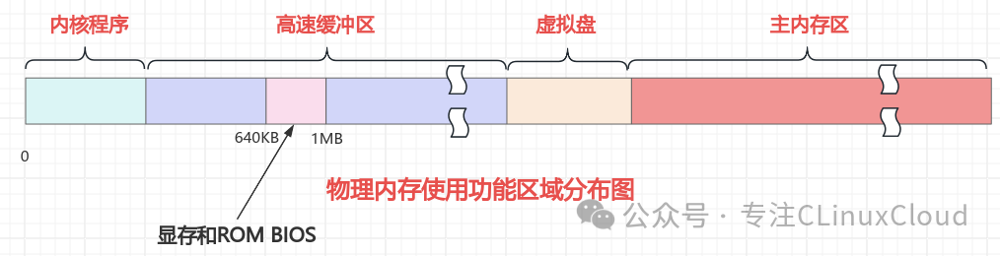

# 1.源码讲解
## 1.1内存边界设定-全代码
承接上文，我们完成了根文件的挂载、磁盘驱动器的设置，下一步该干嘛？**源码告诉我们，现在我们该完成内存边界的设置了！**

我们直接看代码：

```c
    memory_end = (1<<20) + (EXT_MEM_K<<10);
	memory_end &= 0xfffff000;
	if (memory_end > 16*1024*1024)
		memory_end = 16*1024*1024;
	if (memory_end > 12*1024*1024) 
		buffer_memory_end = 4*1024*1024;
	else if (memory_end > 6*1024*1024)
		buffer_memory_end = 2*1024*1024;
	else
		buffer_memory_end = 1*1024*1024;
	main_memory_start = buffer_memory_end;
#ifdef RAMDISK
	main_memory_start += rd_init(main_memory_start, RAMDISK*1024);
#endif
```
## 1.2 内存边界设定-逐行讲解
### 1.2.1 内存结束地址计算
```c
    memory_end = (1<<20) + (EXT_MEM_K<<10);
```
这里的`memory_end`和`EXT_MEM_K`分别是指啥？
```c
static long memory_end = 0; 
#define EXT_MEM_K (*(unsigned short *)0x90002)
```
显然：

|名词|解释|作用|
|-|-|-|
| memory_end | main.c中的静态变量，表示内存结束地址 |标记可用物理内存的最高地址，供后续内存管理使用。|
| EXT_MEM_K |  main.c中的宏，表示扩展内存大小（KB） |

#### 1.2.2 拓展内存

上面提到了拓展内存，那**啥是拓展内存**呢？

扩展内存（Extended Memory） 是指 **1MB 以上的物理内存空间**，在 x86 架构的实模式（Real Mode）下**无法直接访问的内存区域**。它在早期的 PC 系统中是一个关键概念，尤其是在 DOS 和早期多任务操作系统（如 Linux 0.11） 中。

如下：
 

##### 🔹 **1. 内存分段：常规内存 vs. 扩展内存**
在 x86 架构中，物理内存被划分为不同的区域：

| 内存类型|地址范围|大小| 访问方式|用途|
|-|-|-|-|-|
| **常规内存**   | `0x00000 - 0x9FFFF`| 640KB| 实模式可直接访问 | DOS 程序、BIOS 数据、显存等   |
| **上位内存**   | `0xA0000 - 0xFFFFF`  | 384KB| 实模式可直接访问（特殊区域） | 显存（VGA）、BIOS ROM|
| **高端内存**   | `0x100000 - 0x10FFEF`| ~64KB| 需通过 XMS 或 HMA 访问| DOS 扩展程序 |
| **扩展内存**   | `0x100000` 以上 | 动态| 需切换到保护模式或特殊驱动| **现代操作系统**、大型应用程序 |

> 💡 **关键区别**：  
> - **常规内存（Conventional Memory）**：DOS 程序默认运行区域（640KB）。  
> - **扩展内存（Extended Memory）**：1MB 以上，需特殊方式访问。

---

##### 🔹 **2. 为什么需要扩展内存？**
###### **(1) 实模式的 20 位地址限制**
- 早期 8086 CPU 的地址总线为 20 位（`段寄存器<<4 + 偏移`），最大寻址空间为 **1MB（0x00000 - 0xFFFFF）**。  
- 超出 1MB 的内存（如 4GB）在实模式下无法直接访问，必须通过**保护模式**或特殊技术（如 XMS）访问。
 
### 1.2.2 内存结束地址对齐
接着往下看
```c
	memory_end &= 0xfffff000;
```
这句话代表着什么呢？

显然，&=操作后，memory_end中对应为f字段的所有位都被设置为1，剩下的12位都是0，那么显然，memory_end一定是2^12=4KB的整数倍！

显然，这里就是为了对齐操作！将内存边界强制对齐在4KB的整数倍！

### 1.2.3 依memory边界判断buffer边界
#### 1.2.3.1 总物理内存定界+缓冲区大小判断
```c
if (memory_end > 16*1024*1024)//如果内存结束地址大于16MB
		memory_end = 16*1024*1024;//如果内存结束地址大于16MB，将其强制设置为16MB。确保了Linux0.11内存不会超过16MB。
	if (memory_end > 12*1024*1024) //如果内存结束地址大于12MB
		buffer_memory_end = 4*1024*1024;//如果内存结束地址大于12MB，将buffer_memory_end设置为4MB。内存边界不变。
	else if (memory_end > 6*1024*1024)
		buffer_memory_end = 2*1024*1024;//如果内存结束地址大于6MB，将buffer_memory_end设置为2MB。内存边界不变。
	else
		buffer_memory_end = 1*1024*1024;//如果内存结束地址小于等于6MB，将buffer_memory_end设置为1MB。内存边界不变。
```
显然，这是一系列判断，根据memory_end的大小，来**确定buffer_memory_end的大小**。并且限制了Linux0.11的物理内存总大小。

|定界|具体|
|-|-|
|总物理内存大小|不会超过16MB|
|缓冲区大小|依据总物理内存大小来确定|

#### 1.2.3.2  为啥要限制缓冲区大小？
这不得说到，Linux0.11的物理内存的总架构：
开局一张图，详情点链接：

[](https://mp.weixin.qq.com/s/P8Lw_V8Y4ZVghv8pez1hpA)

点击👆的图片可以跳转。